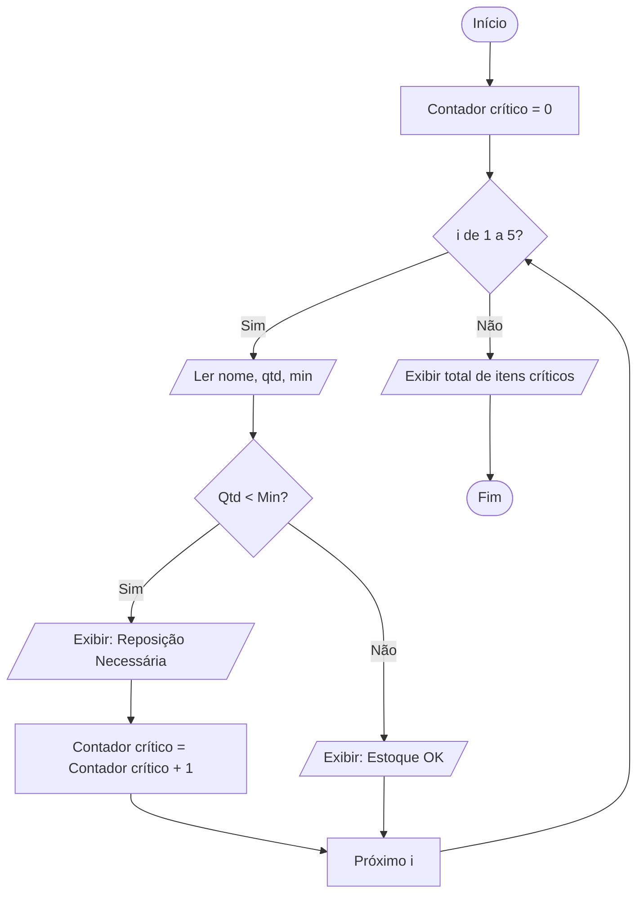

# Laboratório de Programação

## Otimização de Reposição do Almoxarifado Central

Este documento apresenta uma situação-problema realista baseada nos conceitos de lógica de programação, estruturada para simular um desafio profissional de desenvolvimento de software.

## 1. Contexto do Cliente

> "Olá, sou o responsável pelo Almoxarifado Central. Atualmente, nosso controle de estoque é feito de forma manual em planilhas de papel, o que tem causado problemas graves. Muitas vezes, só percebemos que um item acabou quando alguém solicita e a prateleira está vazia. Isso trava a operação de outros departamentos.
>
> Trabalhamos com diversos itens, mas, para este projeto piloto, gostaria de focar na conferência diária de um lote fixo de 5 itens críticos. Hoje, passo de prateleira em prateleira, anoto o nome do produto, quanto há no estoque e qual é o nível mínimo que deveria ter. Se o que tenho for menor que o mínimo, preciso fazer um pedido de compra urgente.
>
> O que preciso é de um programa simples em que eu possa digitar os dados de cada um dos 5 itens e, ao final, receber um relatório rápido indicando quais precisam de reposição e quantos itens estão nessa situação crítica. Isso me ajudaria a planejar as compras da semana em poucos minutos."

## 2. Necessidade do Cliente

### O que o cliente precisa?

O cliente busca uma solução que automatize a verificação de estoque para um grupo de 5 produtos. O sistema deve permitir a entrada do nome, da quantidade atual e do estoque mínimo de cada produto.

O resultado esperado é:

- Uma indicação visual imediata para cada item, informando se precisa ou não de reposição.
- Um resumo final com a contagem total de produtos que atingiram o nível crítico.

## 3. Missão do Aluno

Sua missão é atuar como o programador responsável por traduzir essa necessidade do Almoxarifado em uma solução computacional funcional. Para isso, aplique os conceitos de Entrada, Processamento e Saída (EPS), além de estruturas de decisão e repetição.

Você deverá:

1. Interpretar o contexto do cliente.
2. Identificar os dados de entrada.
3. Identificar o processamento necessário.
4. Identificar as saídas esperadas.
5. Identificar as decisões lógicas.
6. Identificar as repetições (laços).
7. Construir o algoritmo em linguagem natural.
8. Criar o diagrama de blocos (Mermaid).
9. Implementar a solução em Python.
10. Testar a solução com dados fictícios.

## 4. Análise do Problema

Preencha a folha de ataque abaixo antes de iniciar a codificação.

### E — Entrada

- O que vou receber? Ex.: nome do item.
- Quais dados são necessários para os cálculos?

### P — Processamento

- O que preciso calcular ou comparar?
- Quais regras de negócio do cliente devo aplicar?

### S — Saída

- O que preciso mostrar para o usuário em cada etapa?
- Qual é a informação final consolidada?

### Decisão

- Existe alguma condição de "estoque baixo"?
- Quais são os dois caminhos possíveis para cada produto?

### Repetição

- Quantas vezes o processo de leitura de dados deve acontecer?
- Qual estrutura (`for` ou `while`) é mais adequada para um número fixo de itens?

### Estrutura

- Preciso de um contador para o total de itens críticos?
- Como inicializar esse contador?

## 5. Requisitos

- O programa deve solicitar os dados de exatamente 5 itens.
- Para cada item, o usuário deve informar: nome, quantidade atual e estoque mínimo.
- O programa deve comparar a quantidade atual com o estoque mínimo.
- Se a quantidade atual for menor que o estoque mínimo, o programa deve exibir: **"STATUS: Reposição Necessária"**.
- Caso contrário, deve exibir: **"STATUS: Estoque OK"**.
- O programa deve contar quantos itens precisam de reposição.
- Ao final da execução, o programa deve informar o número total de itens que precisam de compra.

## 6. Restrições

- Utilize apenas estruturas de programação estruturada: sequência, decisão e laços.
- Não é necessário validar se os números são negativos; considere que o usuário digitará valores válidos.
- A contagem de itens (5) deve ser controlada por uma estrutura de repetição, evitando a duplicação manual de código.

## 7. Entrega do Aluno

### Entregáveis

O aluno deverá entregar:

- Análise EPS preenchida.
- Identificação das decisões e repetições.
- Algoritmo em linguagem natural (passo a passo).
- Diagrama de blocos utilizando a sintaxe Mermaid.
- Código-fonte em Python.
- Relatório de um teste realizado.

## 8. Dicas

- **Dica 1 — Interpretação:** O cliente mencionou que o processo se repete para 5 itens. Qual estrutura de controle permite repetir um bloco de código um número definido de vezes?
- **Dica 2 — Lógica:** Para contar quantos itens estão críticos, você precisará de uma variável `contador` que comece em zero. Onde essa variável deve ser incrementada: dentro ou fora do laço?
- **Dica 3 — Estrutura:** A comparação `Quantidade Atual < Estoque Mínimo` é o coração da estrutura de decisão (`if/else`).
- **Dica 4 — Implementação:** Lembre-se de converter as entradas numéricas para `int` ou `float` em Python, pois `input()` recebe tudo como texto (`string`).

## 9. Gabarito: Resolução Sugerida

### 9.1 Interpretação

O problema consiste em processar um lote fixo de dados. A cada iteração, uma decisão deve ser tomada com base na comparação de dois valores numéricos. Um contador deve registrar as ocorrências positivas da condição de erro (estoque baixo).

### 9.2 Análise EPS

- **Entrada:** Nome do produto, quantidade atual (`qtd`) e quantidade mínima (`min`).
- **Processamento:** Verificar se `qtd < min`. Se sim, somar 1 ao contador de itens críticos.
- **Saída:** Status do item individual e, ao final, o valor total do contador.

### 9.3 Decisões e Repetições

- **Repetição:** Um laço `for` de 1 a 5.
- **Decisão:** Um `if` para verificar a necessidade de reposição.

### 9.4 Algoritmo (Linguagem Natural)

1. Iniciar o contador de itens críticos em 0.
2. Repetir 5 vezes:
   1. Ler o nome do produto.
   2. Ler a quantidade atual.
   3. Ler a quantidade mínima.
   4. Se a quantidade atual for menor que a quantidade mínima:
      - Escrever "Reposição Necessária".
      - Adicionar 1 ao contador de itens críticos.
   5. Caso contrário, escrever "Estoque OK".
3. Após as 5 repetições, exibir o valor total do contador.

### 9.5 Diagrama Mermaid



### 9.6 Código Python

```python
# Inicialização
itens_criticos = 0

print("--- SISTEMA DE CONTROLE DE ESTOQUE CRÍTICO ---")

# Estrutura de repetição para 5 itens
for i in range(1, 6):
    print(f"\nProduto {i}:")
    nome = input("Nome do item: ")
    qtd_atual = int(input("Quantidade em estoque: "))
    qtd_minima = int(input("Quantidade mínima permitida: "))

    # Estrutura de decisão
    if qtd_atual < qtd_minima:
        print(f"STATUS para {nome}: >>> REPOSIÇÃO NECESSÁRIA <<<")
        itens_criticos = itens_criticos + 1
    else:
        print(f"STATUS para {nome}: Estoque OK.")

# Saída final
print("\n" + "=" * 40)
print(f"RELATÓRIO FINAL: {itens_criticos} itens precisam de compra urgente.")
print("=" * 40)
```

### 9.7 Explicação da Solução

A solução utiliza o laço `for` com `range(1, 6)` para garantir que o processo ocorra exatamente 5 vezes, conforme solicitado. O contador `itens_criticos`, inicializado fora do laço, permite que o programa registre quantas vezes a condição de estoque baixo foi satisfeita.

A estrutura `if/else` fornece feedback imediato ao usuário sobre cada item processado.

### 9.8 Resultados Esperados (Exemplo de Teste)

| Item | Quantidade atual | Estoque mínimo | Resultado |
| --- | ---: | ---: | --- |
| Papel A4 | 2 | 10 | Reposição Necessária |
| Caneta | 50 | 20 | Estoque OK |

> **Resultado final do exemplo:** Se apenas o Papel A4 estiver abaixo do mínimo em um teste de 5 itens, o total final será 1.
