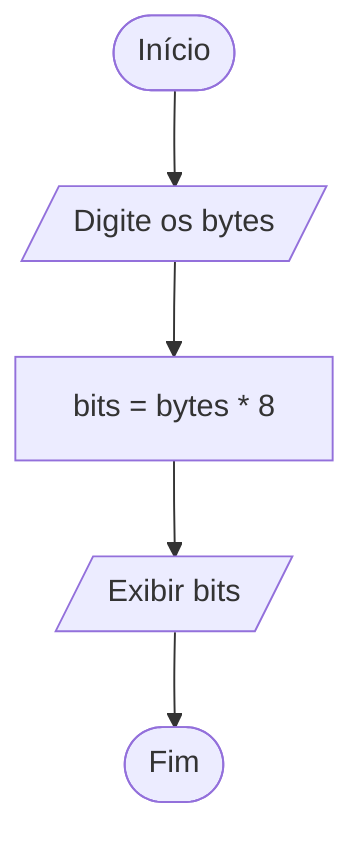
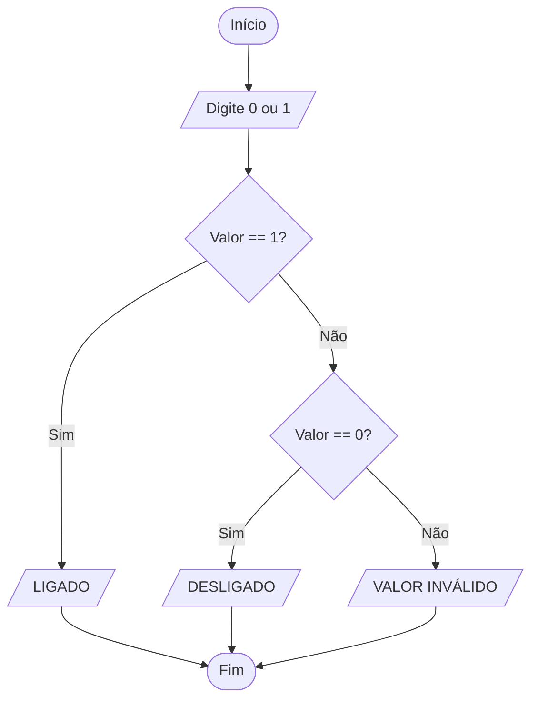
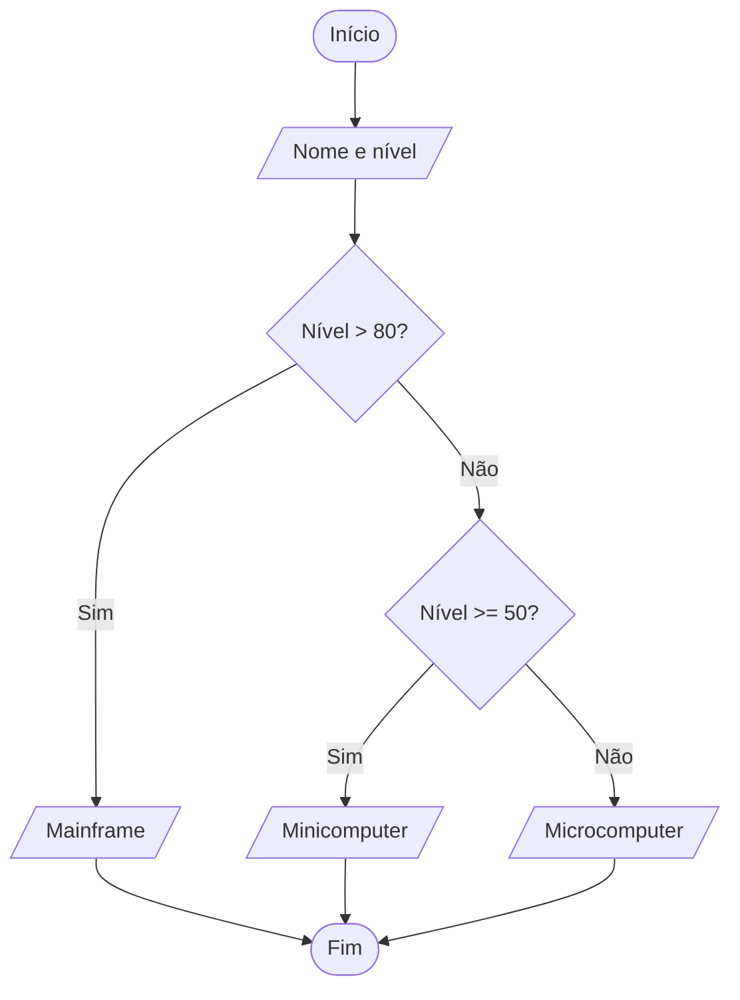
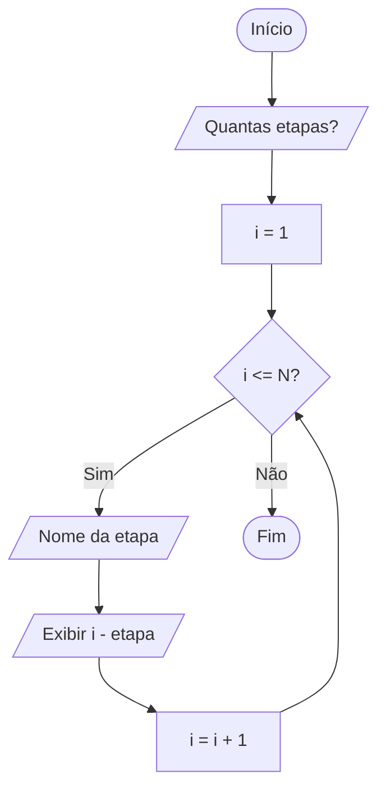
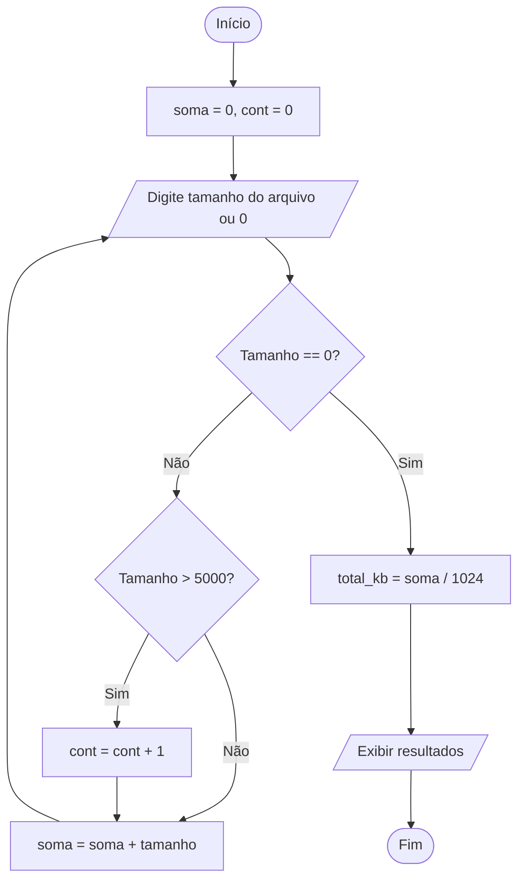

# Lista de Exercícios: Introdução à Programação

Esta lista foi elaborada com o objetivo de desenvolver o raciocínio lógico e a capacidade de resolução de problemas, utilizando os conceitos fundamentais de algoritmos e programação em Python presentes no material de estudo.

## Exercícios

### Exercícios fáceis

#### Exercício 1 — Conversor de Grandezas Digitais

**Nível:** Fácil

**Problema:** No estudo da organização de computadores, aprendemos que a menor unidade de dado é o bit e que um byte é um conjunto de oito bits. Crie uma ferramenta simples para auxiliar estudantes a converter valores de bytes para bits.

**O que o programa deve fazer:** Receber um valor inteiro representando uma quantidade de bytes e exibir o equivalente em bits.

**Perguntas de planejamento:**

1. Qual é a entrada?
2. Qual é o processamento?
3. Qual é a saída?
4. Existe alguma decisão?
5. Existe repetição?
6. Qual estrutura deve ser utilizada?
7. É necessário um contador ou acumulador?

**Tarefa:** Desenvolva o diagrama de blocos (Mermaid) e o código em Python.

**Dicas:**

- **Dica 1:** Quantos bits existem dentro de 1 byte, segundo o material?
- **Dica 2:** Se você tem 2 bytes, deve multiplicar ou dividir por 8 para encontrar os bits?
- **Dica 3:** Use a função `input()` para a entrada e lembre-se de converter o valor para `int()`.

#### Exercício 2 — Verificador de Estado Binário

**Nível:** Fácil

**Problema:** Internamente, o computador opera com códigos binários em que o valor `1` representa um componente ligado e `0` representa um componente desligado.

**O que o programa deve fazer:** Ler um dígito binário (`0` ou `1`) e informar por extenso se o componente está "LIGADO" ou "DESLIGADO". Caso o usuário digite algo diferente, o programa deve avisar que o valor é inválido.

**Perguntas de planejamento:**

1. Qual é a entrada?
2. Qual é o processamento?
3. Qual é a saída?
4. Existe alguma decisão?
5. Existe repetição?
6. Qual estrutura deve ser utilizada?
7. É necessário um contador ou acumulador?

**Tarefa:** Desenvolva o diagrama de blocos (Mermaid) e o código em Python.

**Dicas:**

- **Dica 1:** Este problema envolve verificar uma condição específica do dado de entrada.
- **Dica 2:** Você precisará comparar o valor de entrada com as duas possibilidades permitidas.
- **Dica 3:** Utilize a estrutura `if`, `elif` e `else` para tratar as três situações: `0`, `1` ou inválido.

### Exercícios médios

#### Exercício 3 — Analisador de Mercado Computacional

**Nível:** Médio

**Problema:** O mercado de computação é dividido em segmentos: Mainframes (28% de interesse), Minicomputers (11%) e Microcomputers (61%). Uma empresa quer classificar seus equipamentos com base no poder de processamento.

**O que o programa deve fazer:** Pedir o nome de um equipamento e o seu "Nível de Processamento" (um valor de 1 a 100).

- Se o nível for maior que 80, classificar como "Mainframe".
- Se o nível estiver entre 50 e 80, classificar como "Minicomputer".
- Se for menor que 50, classificar como "Microcomputer".

**Perguntas de planejamento:**

1. Qual é a entrada?
2. Qual é o processamento?
3. Qual é a saída?
4. Existe alguma decisão?
5. Existe repetição?
6. Qual estrutura deve ser utilizada?
7. É necessário um contador ou acumulador?

**Tarefa:** Desenvolva o diagrama de blocos (Mermaid) e o código em Python.

**Dicas:**

- **Dica 1:** O problema exige a análise de faixas de valores (intervalos).
- **Dica 2:** Pense em como organizar os testes lógicos para que um não anule o outro.
- **Dica 3:** Em Python, para verificar se um número está entre dois valores, você pode usar `if 50 <= nivel <= 80:`.

#### Exercício 4 — Simulador de "Misto Quente" (Algoritmo Sequencial)

**Nível:** Médio

**Problema:** Um algoritmo pode ser comparado a uma receita. O material propõe o desafio de elaborar um algoritmo para fazer um "misto quente". Vamos automatizar a contagem das etapas desse preparo.

**O que o programa deve fazer:** Perguntar ao usuário quantas etapas ele deseja registrar para sua receita. Em seguida, usando um laço, pedir o nome de cada etapa (por exemplo, "Pegar o pão" e "Colocar o queijo") e, ao final, mostrar a lista numerada.

**Perguntas de planejamento:**

1. Qual é a entrada?
2. Qual é o processamento?
3. Qual é a saída?
4. Existe alguma decisão?
5. Existe repetição?
6. Qual estrutura deve ser utilizada?
7. É necessário um contador ou acumulador?

**Tarefa:** Desenvolva o diagrama de blocos (Mermaid) e o código em Python.

**Dicas:**

- **Dica 1:** Se você sabe de antemão quantas vezes vai repetir, qual estrutura de laço é mais indicada?
- **Dica 2:** Você precisará de uma variável para guardar a contagem atual da etapa.
- **Dica 3:** Use o laço `for` com a função `range()` .

### Exercício difícil

#### Exercício 5 — Auditoria de Unidades de Armazenamento

**Nível:** Difícil

**Problema:** Um técnico precisa analisar vários arquivos e somar o espaço total ocupado em Kbytes (KB), mas recebe as informações de cada arquivo em Bytes (B). Ele continuará inserindo tamanhos de arquivos até digitar o valor `0` (zero).

**O que o programa deve fazer:** Ler o tamanho de vários arquivos em Bytes, um por um. Ao final, quando o usuário digitar `0`:

1. Exibir o total acumulado em Bytes.
2. Exibir o total convertido para Kbytes, sabendo que 1 KB = 1.024 Bytes.
3. Informar quantos arquivos tinham mais de 5.000 Bytes.

**Perguntas de planejamento:**

1. Qual é a entrada?
2. Qual é o processamento?
3. Qual é a saída?
4. Existe alguma decisão?
5. Existe repetição?
6. Qual estrutura deve ser utilizada?
7. É necessário um contador ou acumulador?

**Tarefa:** Desenvolva o diagrama de blocos (Mermaid) e o código em Python.

**Dicas:**

- **Dica 1:** O programa para quando uma condição é atingida (digitar `0`), portanto o número de repetições é desconhecido.
- **Dica 2:** Você precisará de duas variáveis auxiliares: uma para somar os valores (acumulador) e outra para contar quantos arquivos atendem ao critério de tamanho (contador).
- **Dica 3:** Utilize o laço `while` para manter o programa rodando até o critério de parada.

## Gabarito

Abaixo encontram-se as resoluções sugeridas com base no método EPS e na lógica de programação.

### Gabarito — Exercício 1

#### 1. EPS — Exercício 1

- **E:** Quantidade de bytes (inteiro).
- **P:** Multiplicar bytes por 8.
- **S:** Quantidade de bits.

#### 2. Estratégia — Exercício 1

Operação aritmética simples de multiplicação.

#### 3. Algoritmo — Exercício 1

Ler bytes; calcular `bits = bytes * 8`; imprimir bits.

#### 4. Diagrama — Exercício 1



#### 5. Python — Exercício 1

```python
bytes_val = int(input("Informe a quantidade de bytes: "))
bits_val = bytes_val * 8
print(f"O equivalente em bits é: {bits_val}")
```

### Gabarito — Exercício 2

#### 1. EPS — Exercício 2

- **E:** Dígito binário (`0` ou `1`).
- **P:** Verificar se é `0`, `1` ou outro valor.
- **S:** Mensagem correspondente.

#### 2. Estratégia — Exercício 2

Desvio condicional composto.

#### 3. Algoritmo — Exercício 2

Ler o valor; se o valor for `0`, exibir "DESLIGADO"; senão, se for `1`, exibir "LIGADO"; caso contrário, exibir "INVÁLIDO".

#### 4. Diagrama — Exercício 2



#### 5. Python — Exercício 2

```python
valor = input("Informe o estado (0 ou 1): ")

if valor == "1":
    print("Estado: LIGADO")
elif valor == "0":
    print("Estado: DESLIGADO")
else:
    print("Valor inválido!")
```

### Gabarito — Exercício 3

#### 1. EPS — Exercício 3

- **E:** Nome do equipamento e nível de processamento (0–100).
- **P:** Testar em qual faixa o nível se encontra.
- **S:** Classificação do equipamento.

#### 2. Estratégia — Exercício 3

Múltiplas condições de decisão.

#### 3. Algoritmo — Exercício 3

Ler os dados; se o nível for maior que 80, classificar como Mainframe; se estiver entre 50 e 80, classificar como Minicomputer; caso contrário, classificar como Microcomputer.

#### 4. Diagrama — Exercício 3



#### 5. Python — Exercício 3

```python
nome = input("Nome do equipamento: ")
nivel = int(input("Nível de processamento (1-100): "))

if nivel > 80:
    classe = "Mainframe"
elif nivel >= 50:
    classe = "Minicomputer"
else:
    classe = "Microcomputer"

print(f"O equipamento {nome} é um {classe}.")
```

### Gabarito — Exercício 4

#### 1. EPS — Exercício 4

- **E:** Quantidade de etapas e nomes das etapas.
- **P:** Repetir a leitura conforme a quantidade informada.
- **S:** Lista numerada das etapas.

#### 2. Estratégia — Exercício 4

Laço de repetição com contador.

#### 3. Algoritmo — Exercício 4

Ler `N`; repetir `N` vezes a leitura da etapa e mostrar a etapa com o número atual.

#### 4. Diagrama — Exercício 4



#### 5. Python — Exercício 4

```python
qtd = int(input("Quantas etapas tem o seu misto quente? "))

for i in range(1, qtd + 1):
    etapa = input(f"Descreva a etapa {i}: ")
    print(f"Registrado: {i}. {etapa}")

print("Algoritmo de preparo finalizado!")
```

### Gabarito — Exercício 5

#### 1. EPS — Exercício 5

- **E:** Tamanhos de arquivos (vários).
- **P:** Acumular a soma, contar arquivos maiores que 5.000 Bytes e converter a soma para KB.
- **S:** Total em Bytes, total em Kbytes e contagem de arquivos grandes.

#### 2. Estratégia — Exercício 5

Laço `while` (repetição condicional), acumulador (soma) e contador.

#### 3. Algoritmo — Exercício 5

Enquanto o valor digitado não for `0`, somar o valor ao total e, se o valor for maior que 5.000, incrementar o contador. Ao sair do laço, calcular KB e exibir os resultados.

#### 4. Diagrama — Exercício 5



#### 5. Python — Exercício 5

```python
soma_bytes = 0
cont_grandes = 0
tamanho = -1  # Valor inicial para entrar no loop

while tamanho != 0:
    tamanho = int(input("Tamanho do arquivo em Bytes (ou 0 para sair): "))
    if tamanho != 0:
        soma_bytes = soma_bytes + tamanho
        if tamanho > 5000:
            cont_grandes = cont_grandes + 1

total_kb = soma_bytes / 1024

print("--- RELATÓRIO DE AUDITORIA ---")
print(f"Total em Bytes: {soma_bytes} B")
print(f"Total em Kbytes: {total_kb:.2f} KB")
print(f"Arquivos maiores que 5000 Bytes: {cont_grandes}")
```
