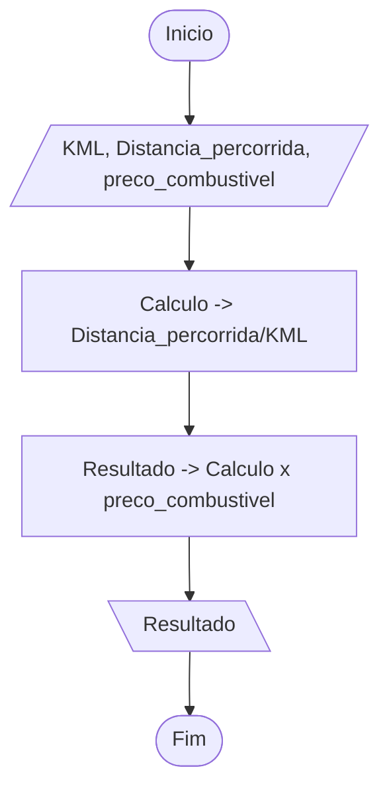

# Entendendo o problema

Contexto: Empresa logistica

- calcular o custo estimado de combustível de cada rota planejada
  - com base na quilometragem informada pelo despachante.

## EPS - Entrada, Processamento e Saída

- Entrada:
  - Distancia total
  - Litros combustivel
  - Preço do combustivel

- Processamento:
  - calculo -> (distancia/consumo) * preco

- Saída:
  - A quantidade total de litros de combustível que serão consumidos na viagem.
  - O custo financeiro total estimado para o abastecimento do veículo.

