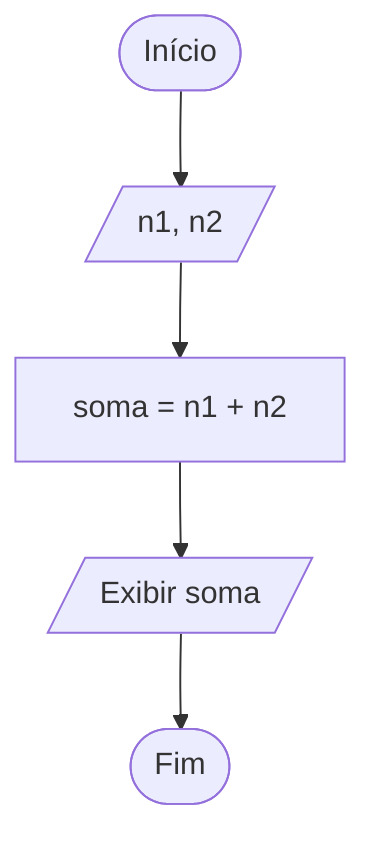

# Guia de Estudos: Módulo 1

## Entrada, Processamento e Saída de Dados

Bem-vindo ao material de consulta do Módulo 1. Este guia foi desenvolvido para transformar você de um simples "digitador de código" em um programador de verdade, capaz de analisar problemas e construir soluções lógicas eficientes.

## 1. Introdução: Algoritmo vs. Programa

Muitos iniciantes cometem o erro de abrir o editor de código assim que leem um enunciado. No entanto, a programação de qualidade começa no papel, não no teclado.

- **Algoritmo:** É uma sequência finita de passos bem definidos e ordenados para a solução de um problema ou realização de uma tarefa. Pode ser comparado a uma receita culinária, que possui ingredientes (dados) e modo de preparo (instruções).
- **Programa:** É a implementação de um algoritmo em uma linguagem de programação (como Python) que o computador consegue interpretar e executar.

Por que pensar antes de programar? Fazer algoritmos preliminares garante uma visão adequada do problema e evita erros de lógica, que são muito mais difíceis de corrigir do que erros de sintaxe. Programar por "tentativa e erro" é ineficiente e antiprofissional.

## 2. O Método EPS: A Base do Raciocínio

Para resolver qualquer problema computacional, você deve primeiro dividi-lo em três partes fundamentais:

| Sigla | Fase | Pergunta central | Descrição |
| --- | --- | --- | --- |
| E | Entrada | O que vou receber? | São os dados iniciais necessários para a resolução. |
| P | Processamento | O que preciso calcular? | É o conjunto de operações lógicas e aritméticas. |
| S | Saída | O que preciso mostrar? | É a informação final entregue ao usuário. |

> **Regra de ouro:** Antes de digitar a primeira linha de código, preencha sua "Folha de Ataque ao Problema" identificando o E, o P e o S.

## 3. Entrada de Dados em Python

A entrada permite que o usuário forneça dados ao programa. No computador, isso geralmente ocorre via teclado e é capturado pela Unidade Central de Processamento (CPU) para ser armazenado temporariamente na Memória RAM.

### A função `input()` e variáveis

- **Variável:** Um espaço na memória RAM que guarda um valor. Imagine uma caixa com um nome (etiqueta) e um conteúdo.
- **`input()`:** Captura o que o usuário digita como um texto (`string`).

### Conversão de tipos (casting)

Como `input()` sempre retorna texto, precisamos converter o dado se quisermos fazer cálculos:

- **`int()`:** Converte para número inteiro (ex.: `10`, `-5`).
- **`float()`:** Converte para número real (ex.: `1.75`, `10.0`).
- **`str()`:** Converte para texto.

### Exemplo

```python
idade = int(input("Digite sua idade: "))  # O texto vira número inteiro
peso = float(input("Digite seu peso: "))  # O texto vira número real
```

## 4. Processamento: Variáveis e Matemática

O processamento é onde a "mágica" acontece, utilizando a Unidade Lógica e Aritmética (ULA) da CPU.

### Operadores aritméticos

| Operador | Operação | Exemplo |
| --- | --- | --- |
| `+` | Adição | `5 + 2 = 7` |
| `-` | Subtração | `5 - 2 = 3` |
| `*` | Multiplicação | `5 * 2 = 10` |
| `/` | Divisão real | `5 / 2 = 2.5` |
| `//` | Divisão inteira | `5 // 2 = 2` |
| `%` | Resto da divisão (módulo) | `5 % 2 = 1` |
| `**` | Potenciação | `5 ** 2 = 25` |

### Precedência de operadores

A ordem de cálculo segue a matemática:

1. Parênteses: `()`
2. Potenciação: `**`
3. Multiplicação e divisão: `*`, `/`, `//`, `%`
4. Adição e subtração: `+`, `-`

### Atribuição

O símbolo `=` não significa "igual" (comparação), mas sim atribuição. Ele armazena o resultado da direita na variável à esquerda. Em `resultado = 10 + 5`, a variável `resultado` passa a valer `15`.

## 5. Saída de Dados

A saída é a apresentação dos dados processados, enviada para a unidade de saída (monitor).

### A função `print()`

Usada para mostrar mensagens e valores de variáveis.

```python
print("O resultado final é:", resultado)
```

## 6. O Ciclo de Resolução de Problemas

Siga sempre este fluxo:

1. **Entender o problema:** Ler atentamente.
2. **EPS:** Identificar Entrada, Processamento e Saída.
3. **Algoritmo:** Escrever os passos em linguagem natural.
4. **Diagrama de blocos:** Desenhar a lógica gráfica (Norma ISO 5807:1985).
5. **Python:** Traduzir para código.
6. **Teste de mesa:** Simular a execução manualmente para verificar se a lógica está correta.

## 7. Exemplo Completo: Soma de Dois Números

**Problema:** Desenvolva um programa que peça dois números inteiros ao usuário e exiba a soma deles.

### Passo 1: EPS

- **E:** Dois números inteiros (`n1`, `n2`).
- **P:** Somar `n1` com `n2` (`soma = n1 + n2`).
- **S:** Mostrar o resultado da soma.

### Passo 2: Algoritmo (linguagem natural)

1. Início.
2. Ler o primeiro número (`n1`).
3. Ler o segundo número (`n2`).
4. Calcular a soma de `n1` e `n2`.
5. Mostrar o resultado da soma.
6. Fim.

### Passo 3: Diagrama de blocos



### Passo 4: Código Python

```python
# Entrada
n1 = int(input("Digite o primeiro número: "))
n2 = int(input("Digite o segundo número: "))

# Processamento
soma = n1 + n2

# Saída
print("A soma dos números é:", soma)
```

### Passo 5: Teste de mesa

| `n1` (entrada) | `n2` (entrada) | `soma` (cálculo) | Saída esperada |
| ---: | ---: | ---: | ---: |
| 10 | 5 | 15 | 15 |
| -2 | 8 | 6 | 6 |

## 8. Exemplos Progressivos

### Exemplo A: Média de notas

- **EPS:** `E(nota1, nota2)`, `P(media = (nota1 + nota2) / 2)`, `S(media)`.
- **Código:**

```python
n1 = float(input("Nota 1: "))
n2 = float(input("Nota 2: "))
media = (n1 + n2) / 2
print("Média final:", media)
```

### Exemplo B: Conversão de salário

- **Problema:** Calcular o novo salário com 10% de aumento.
- **EPS:** `E(salario)`, `P(novo = salario * 1.10)`, `S(novo)`.
- **Código:**

```python
salario = float(input("Salário atual: "))
novo_salario = salario + (salario * 0.10)
print("Novo salário:", novo_salario)
```

## 9. Erros Comuns de Iniciantes

### 1. Esquecer a conversão do `input()`

- **Errado:** `n1 = input()` (o Python tratará o valor como texto).
- **Correção:** `n1 = int(input())` ou `n1 = float(input())`.

### 2. Confundir divisões

- **`/`:** Divisão real (`10 / 4 = 2.5`).
- **`//`:** Divisão inteira (`10 // 4 = 2`).
- **`%`:** Resto da divisão (`10 % 4 = 2`).

### 3. Erro de sintaxe em variáveis

- **Errado:** `1_numero = 10` (variáveis não podem começar com números).
- **Correção:** `numero_1 = 10`.

## 10. Folha de Ataque ao Problema

Use este modelo para todos os seus exercícios:

### E — Entrada

O que vou receber do usuário? Quais variáveis preciso criar?

### P — Processamento

Quais contas ou cálculos matemáticos devo realizar? Qual a ordem das operações?

### S — Saída

O que deve aparecer na tela como resultado final?

## 11. Checklist Pré-Entrega

Antes de finalizar sua prova ou exercício, verifique:

- [ ] Eu entendi o que o enunciado pediu de verdade?
- [ ] Identifiquei corretamente as entradas (E)?
- [ ] O processamento (P) está matematicamente correto?
- [ ] Usei os tipos certos (`int` ou `float`)?
- [ ] Fiz o teste de mesa com valores diferentes?
- [ ] O código roda sem erros de sintaxe?

## 12. Consulta Rápida (Glossário e Sintaxe)

### Conceitos de hardware e dados

- **Bit:** Menor unidade (`0` ou `1`). Representa um estado ligado/desligado.
- **Byte:** Conjunto de 8 bits. Representa um caractere.
- **ASCII:** Tabela padrão que mapeia códigos numéricos para caracteres.
- **RAM:** Memória volátil (apaga ao desligar) que armazena dados em uso.
- **CPU:** O "cérebro" que processa as instruções lógicas e aritméticas.

### Resumo de sintaxe

```python
# Entrada com conversão
var = float(input("Mensagem"))

# Operadores
+ - * /     # Básicos
// % **     # Inteira, resto e potência

# Saída
print("Texto", variavel)
```

## 13. Quiz de Fixação

1. **O que é um algoritmo?**
   - a) Um computador de última geração.
   - b) Uma sequência finita de passos para resolver um problema.
   - c) Um erro que acontece no código Python.

2. **Qual é a função do operador `%` em Python?**
   - a) Calcular a porcentagem de um número.
   - b) Dividir um número por cem.
   - c) Retornar o resto de uma divisão inteira.

3. **Se `a = 10` e `b = 3`, qual é o resultado de `a // b`?**
   - a) `3.333`
   - b) `3`
   - c) `1`

4. **Por que `n = input("Digite um número: ")` pode causar erros em cálculos?**
   - a) Porque o Python não aceita números no `input`.
   - b) Porque o comando captura o dado como texto (`string`).
   - c) Porque falta o ponto e vírgula no final.

5. **No método EPS, o cálculo de uma média de notas entra em qual fase?**
   - a) Entrada.
   - b) Processamento.
   - c) Saída.

### Gabarito do quiz

| Questão | Resposta |
| ---: | :---: |
| 1 | b |
| 2 | c |
| 3 | b |
| 4 | b |
| 5 | b |

> **Lembre-se sempre:** Problema → EPS → Algoritmo → Diagrama → Python → Teste
