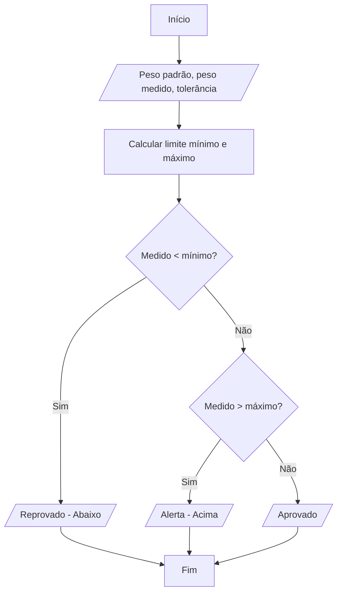

# Laboratório de Programação

## Sistema de Verificação de Qualidade LogiStore

Este documento apresenta uma proposta de laboratório prático fundamentada nos conceitos de lógica de programação e algoritmos, simulando uma demanda real do setor administrativo e de logística.

## 1. Contexto do Cliente

> "Olá, sou o Ricardo, gerente de operações da LogiStore. Nossa empresa gerencia um centro de distribuição que despacha milhares de pacotes diariamente. Um dos nossos maiores gargalos atuais é o setor de Verificação de Qualidade, especificamente na pesagem dos volumes.
>
> Atualmente, o processo é manual: o operador coloca o pacote na balança, olha o peso padrão impresso na ordem de serviço e verifica em uma tabela de papel se o peso medido está dentro de uma margem aceitável de erro. Se o peso estiver muito abaixo, o pacote é retirado para verificar se faltam itens. Se estiver muito acima, verificamos se houve erro na embalagem ou itens duplicados.
>
> O problema é que, com o cansaço, os operadores cometem erros de julgamento, deixando passar pacotes fora do padrão ou travando a linha com pacotes corretos. Precisamos de um programa simples em que o operador insira o peso esperado e o peso real, e o sistema decida imediatamente o destino do pacote."

## 2. Necessidade do Cliente

### O que o cliente precisa?

O cliente busca a automação do processo de decisão na linha de pesagem. O programa deve receber os dados da balança e do sistema de pedidos e informar ao operador uma das três situações:

1. **Aprovado:** O peso está dentro da margem de tolerância.
2. **Reprovado (abaixo do peso):** O peso está abaixo do limite mínimo permitido.
3. **Alerta (acima do peso):** O peso está acima do limite máximo permitido.

O objetivo é transformar os dados brutos (pesos) em informação útil para a tomada de decisão operacional.

## 3. Missão do Aluno

Como programador responsável pelo projeto, sua missão é analisar a necessidade da LogiStore e desenvolver uma solução computacional robusta. Você não deve apenas codificar, mas planejar a solução seguindo as etapas de um desenvolvimento profissional.

Você deverá:

1. Interpretar o contexto e a regra de negócio do cliente.
2. Identificar os dados de entrada, processamento e saída.
3. Identificar as estruturas de decisão necessárias.
4. Construir o algoritmo em linguagem natural.
5. Criar o diagrama de blocos (Mermaid).
6. Implementar a solução em Python.
7. Validar a solução com casos de teste.

## 4. Análise do Problema

Preencha a folha de ataque abaixo para estruturar seu raciocínio antes de iniciar o código.

### E — Entrada

- Quais dados o operador precisará digitar?
- Quais são as variáveis necessárias?

### P — Processamento

- Como calcular os limites mínimo e máximo de tolerância?
- Quais comparações lógicas devem ser feitas entre o peso medido e os limites?

### S — Saída

- Quais mensagens textuais o sistema deve exibir para cada cenário?

### Decisão

- Quais condições (`if`) serão usadas para verificar se o pacote está abaixo, acima ou dentro do peso?

### Repetição

Neste nível médio, o programa deve processar apenas uma verificação por execução. Não há necessidade imediata de um loop para o tempo sugerido de 10 a 15 minutos.

### Estrutura

- Será necessário o uso de `if`, `elif` e `else`?

## 5. Requisitos

- O programa deve solicitar o peso padrão, em kg.
- O programa deve solicitar o peso medido na balança, em kg.
- O programa deve solicitar o percentual de tolerância permitido, por exemplo, 5%.
- O programa deve calcular o limite inferior e o limite superior com base na tolerância.
- O programa deve informar o status final do pacote de forma clara.

## 6. Restrições

- O programa deve considerar valores de ponto flutuante (decimais) para os pesos.
- Pesos negativos não devem ser aceitos (regra de validação simples).
- A decisão deve ser exclusiva: um pacote não pode estar aprovado e em alerta simultaneamente.

## 7. Entrega do Aluno

### Entregáveis

O aluno deverá entregar:

- Análise EPS preenchida.
- Identificação das decisões utilizadas.
- Algoritmo em linguagem natural.
- Diagrama de blocos utilizando a sintaxe Mermaid.
- Código-fonte em Python.
- Relatório dos resultados dos testes sugeridos.

## 8. Testes

Utilize os dados abaixo para verificar se sua lógica está correta. Determine a saída do programa:

| Caso de teste | Peso padrão | Peso medido | Tolerância | Resultado esperado |
| --- | ---: | ---: | ---: | --- |
| Normal | 10,0 kg | 10,2 kg | 5% | Aprovado |
| Limite mínimo | 1,0 kg | 0,94 kg | 5% | Reprovado |
| Limite máximo | 20,0 kg | 22,0 kg | 10% | Aprovado |
| Especial | 5,0 kg | 5,0 kg | 0% | Aprovado |

> **Observação:** Os limites são inclusivos. Portanto, um peso exatamente igual ao limite mínimo ou máximo é considerado aprovado.

## 9. Dicas

- **Dica 1 — Interpretação:** Uma tolerância de 5% sobre um peso de 10 kg significa que o pacote pode pesar entre 9,5 kg e 10,5 kg. Como transformar 5% em um valor matemático para o cálculo?
- **Dica 2 — Lógica:** Você precisará de duas variáveis de controle de limites: `limite_inferior` e `limite_superior`. O pacote só é "Aprovado" se estiver entre esses dois valores, inclusive.
- **Dica 3 — Estrutura:** Utilize o desvio condicional composto (`if`, `elif`, `else`). Se a primeira condição (abaixo do peso) for falsa, verifique a segunda (acima do peso). Se ambas forem falsas, só resta uma opção.
- **Dica 4 — Implementação:** Para ler um número decimal, use `float(input())`. Para calcular a tolerância, você pode usar `valor_tolerancia = peso_padrao * (percentual / 100)`.

## 10. Gabarito (Para o Instrutor)

### 10.1 Interpretação

O problema exige a aplicação de operadores aritméticos para definir faixas de aceitação e operadores relacionais e lógicos para classificar o peso medido em três categorias distintas.

### 10.2 EPS (Entrada, Processamento e Saída)

- **Entrada:** `peso_padrao`, `peso_medido` e `percentual_tolerancia`.
- **Processamento:**
  1. `valor_erro = peso_padrao * (percentual_tolerancia / 100)`
  2. `limite_min = peso_padrao - valor_erro`
  3. `limite_max = peso_padrao + valor_erro`
  4. Comparar `peso_medido` com `limite_min` e `limite_max`.
- **Saída:** Mensagem "Aprovado", "Reprovado (Abaixo)" ou "Alerta (Acima)".

### 10.3 Decisões e Repetições

- **Decisões:** Estrutura `if/elif/else` para classificar o peso.
- **Repetições:** Não solicitadas para este nível e tempo, mas poderiam ser aplicadas para múltiplos pacotes.

### 10.4 Algoritmo (Linguagem Natural)

1. Receber o peso padrão do produto.
2. Receber o peso real medido na balança.
3. Receber a margem de tolerância em porcentagem.
4. Calcular o valor da variação permitida.
5. Calcular o limite mínimo (padrão - variação).
6. Calcular o limite máximo (padrão + variação).
7. Se o peso medido for menor que o limite mínimo, exibir "Reprovado (Abaixo do peso)".
8. Senão, se o peso medido for maior que o limite máximo, exibir "Alerta (Acima do peso)".
9. Caso contrário, exibir "Aprovado".

### 10.5 Diagrama Mermaid



### 10.6 Código Python

```python
# Sistema de Verificação de Qualidade LogiStore

# Entradas
peso_padrao = float(input("Digite o peso padrão (kg): "))
peso_medido = float(input("Digite o peso medido na balança (kg): "))
tolerancia_porcentagem = float(input("Digite a tolerância permitida (%): "))

# Processamento dos limites
valor_variacao = peso_padrao * (tolerancia_porcentagem / 100)
limite_minimo = peso_padrao - valor_variacao
limite_maximo = peso_padrao + valor_variacao

print("-" * 30)
print(f"Faixa aceitável: {limite_minimo:.2f} kg até {limite_maximo:.2f} kg")

# Estrutura de decisão
if peso_medido < limite_minimo:
    print("STATUS: REPROVADO (Abaixo do peso ideal)")
elif peso_medido > limite_maximo:
    print("STATUS: ALERTA (Acima do peso ideal)")
else:
    print("STATUS: APROVADO")

print("-" * 30)
```

### 10.7 Explicação da Solução

A solução utiliza o conceito de desvio condicional composto. A lógica primeiro identifica o erro crítico (falta de produto ou peso abaixo do limite), depois verifica o excesso (peso acima do limite). Se o dado não cair em nenhum desses extremos, ele está na faixa central de aceitação, o que torna o `else` final seguro e eficiente.

### 10.8 Resultados Esperados dos Testes

- **Caso normal (10,2 kg):** Aprovado. O limite está entre 9,5 kg e 10,5 kg.
- **Limite mínimo (0,94 kg):** Reprovado. O limite mínimo era 0,95 kg.
- **Limite máximo (22,0 kg):** Aprovado. O limite máximo era 22,0 kg; somente valores acima dele acionariam o alerta.
- **Caso especial (5,0 kg com 0%):** Aprovado. Qualquer variação faria o pacote sair da faixa aceita.
