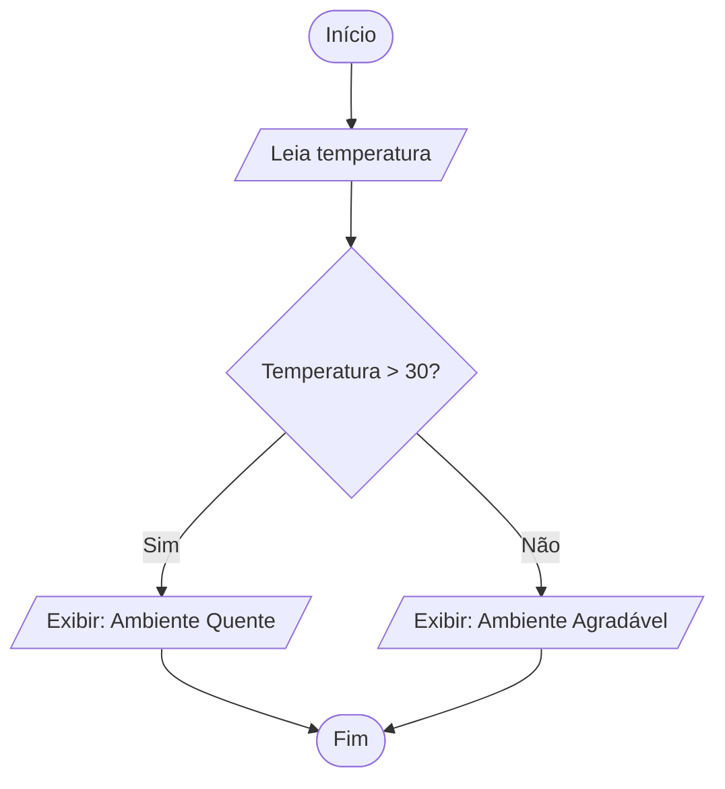
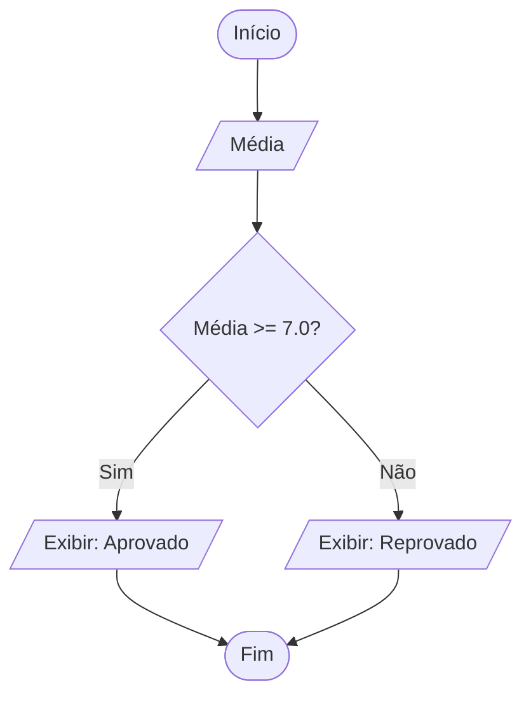
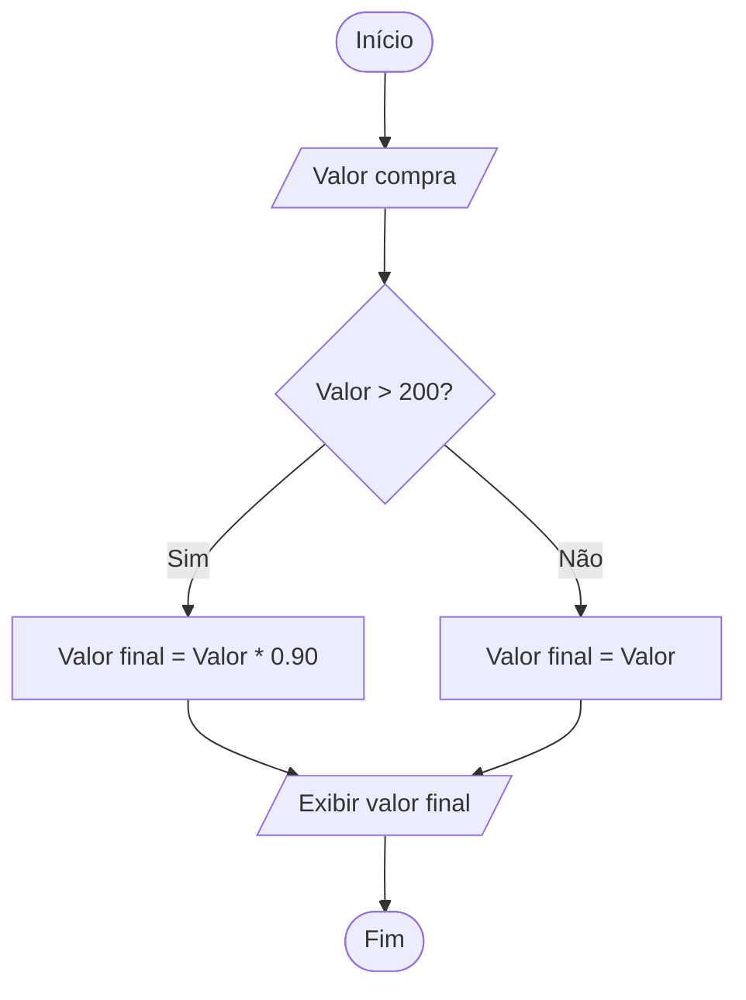
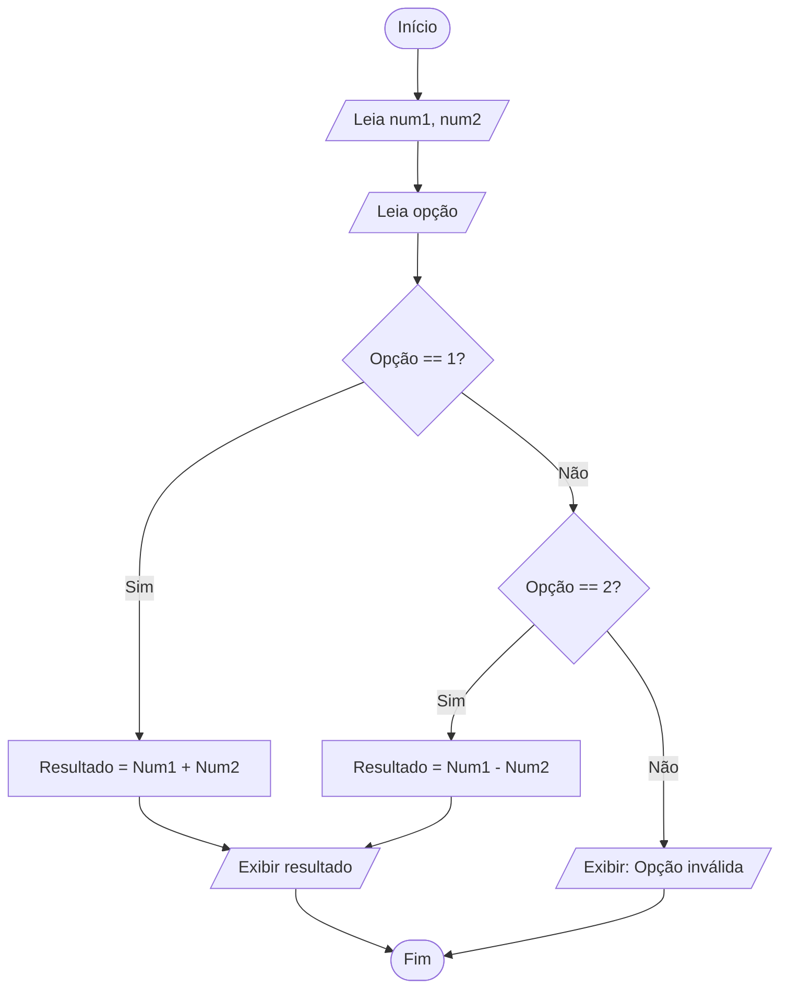
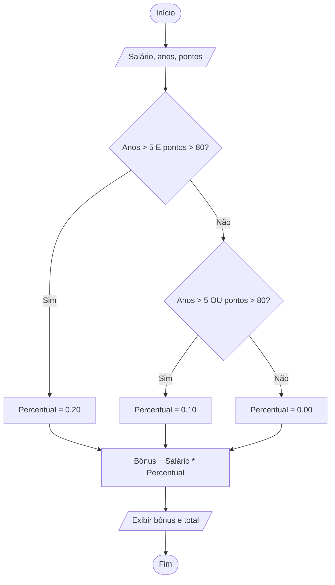

# Lista de Exercícios: Programação com Decisão

Esta lista foi elaborada com base nos princípios de lógica de programação e algoritmos, focando o desenvolvimento do raciocínio lógico e a aplicação de estruturas condicionais utilizando Python.

## Exercícios

### Exercícios fáceis

#### Exercício 1 — Classificador de Temperatura

**Nível:** Fácil

**Problema:** Um sensor de temperatura ambiente fornece a leitura atual em graus Celsius. O sistema deve informar ao usuário se o ambiente está "Quente" ou "Agradável".

**O que o programa deve fazer:** Receber a temperatura atual. Se a temperatura for maior que 30 graus, exibir "Ambiente Quente". Caso contrário, exibir "Ambiente Agradável".

**Perguntas de planejamento:**

1. Qual é a entrada?
2. Qual é o processamento?
3. Qual é a saída?
4. Existe alguma decisão?
5. Existe repetição?
6. Qual estrutura deve ser utilizada?
7. É necessário um contador ou acumulador?

**Tarefa:** Construa o diagrama de blocos (Mermaid) da solução e, em seguida, desenvolva o código em Python.

**Dicas:**

- **Dica 1:** Qual é o valor crítico que muda a resposta do programa?
- **Dica 2:** Utilize uma estrutura que permita dois caminhos baseados em uma comparação.
- **Dica 3:** Em Python, a estrutura que avalia condições é `if/else`.

#### Exercício 2 — Verificação de Aprovação Escolar

**Nível:** Fácil

**Problema:** Um professor precisa de um programa simples para verificar se um aluno foi aprovado em uma disciplina, considerando que a média mínima para aprovação é 7,0.

**O que o programa deve fazer:** Solicitar a média final do aluno. Se a nota for igual ou superior a 7,0, mostrar "Aprovado". Se for inferior, mostrar "Reprovado".

**Perguntas de planejamento:**

1. Qual é a entrada?
2. Qual é o processamento?
3. Qual é a saída?
4. Existe alguma decisão?
5. Existe repetição?
6. Qual estrutura deve ser utilizada?

**Tarefa:** Construa o diagrama de blocos (Mermaid) da solução e desenvolva o código em Python.

**Dicas:**

- **Dica 1:** O que acontece se o aluno tirar exatamente 7,0? Ele está aprovado ou reprovado?
- **Dica 2:** A condição deve comparar a entrada com o valor fixo de aprovação.
- **Dica 3:** Utilize os operadores relacionais `>=` ou `<`.

### Exercícios médios

#### Exercício 3 — Cálculo de Desconto Progressivo

**Nível:** Médio

**Problema:** Uma loja deseja automatizar seu sistema de caixa. Clientes que realizam compras acima de R$ 200,00 recebem um desconto de 10% sobre o valor total. Compras de valor igual ou inferior não recebem desconto.

**O que o programa deve fazer:** Ler o valor total da compra, calcular o valor do desconto se aplicável e exibir o valor final que o cliente deve pagar.

**Perguntas de planejamento:**

1. Qual é a entrada?
2. Qual é o processamento?
3. Qual é a saída?
4. Existe alguma decisão?
5. Qual é a fórmula para calcular 10% de um valor?

**Tarefa:** Construa o diagrama de blocos (Mermaid) e desenvolva a solução em Python.

**Dicas:**

- **Dica 1:** O desconto é fixo para todos os clientes ou depende de uma condição?
- **Dica 2:** Primeiro verifique se o valor ultrapassa o limite; se sim, calcule o novo valor subtraindo o desconto.
- **Dica 3:** Lembre-se de que 10% é o mesmo que multiplicar o valor por `0.10`.

#### Exercício 4 — Menu de Operações Simples

**Nível:** Médio

**Problema:** Um usuário deseja realizar operações matemáticas básicas entre dois números, mas quer escolher qual operação fazer através de um menu: (1) Soma ou (2) Subtração.

**O que o programa deve fazer:** Pedir dois números e, em seguida, mostrar as opções "1 - Somar" ou "2 - Subtrair". Dependendo da escolha, realizar a conta e mostrar o resultado. Se o usuário digitar algo diferente de 1 ou 2, informar "Opção Inválida".

**Perguntas de planejamento:**

1. Qual é a entrada? (Dica: são três entradas.)
2. Qual é o processamento?
3. Qual é a saída?
4. Como tratar múltiplas escolhas de decisão?

**Tarefa:** Construa o diagrama de blocos (Mermaid) e desenvolva a solução em Python.

**Dicas:**

- **Dica 1:** Como o programa sabe qual conta fazer?
- **Dica 2:** Você precisará de uma estrutura que verifique o código da opção antes de processar os números.
- **Dica 3:** Utilize `if`, `elif` e `else` para cobrir as três possibilidades: soma, subtração e opção inválida.

### Exercícios difíceis

#### Exercício 5 — Sistema de Bonificação por Desempenho

**Nível:** Difícil

**Problema:** Uma empresa quer premiar seus funcionários. O bônus depende do tempo de casa (anos) e da pontuação de produtividade (0 a 100).

- Funcionários com mais de 5 anos de casa **e** pontuação acima de 80 recebem um bônus de 20% no salário.
- Funcionários que atendem apenas um desses critérios recebem 10%.
- Quem não atende a nenhum dos critérios não recebe bônus.

**O que o programa deve fazer:** Ler o salário atual, o tempo de casa e a pontuação. Calcular e exibir o valor do bônus e o novo salário total.

**Perguntas de planejamento:**

1. Quais são as entradas?
2. Qual é o processamento para identificar cada faixa de bônus?
3. Como combinar duas condições diferentes (tempo **e** pontuação)?
4. Qual estrutura é mais eficiente para evitar cálculos repetidos?

**Tarefa:** Construa o diagrama de blocos (Mermaid) e desenvolva a solução em Python.

**Dicas:**

- **Dica 1:** Existem condições compostas aqui. Quais operadores lógicos ligam os critérios?
- **Dica 2:** Verifique primeiro a condição mais restrita (os dois critérios juntos) antes das condições parciais.
- **Dica 3:** Utilize operadores lógicos como `and` e `or` dentro das instruções `if`.

## Gabarito

Abaixo encontram-se as resoluções sugeridas com base no método EPS e na lógica de programação.

### Gabarito — Exercício 1: Classificador de Temperatura

#### EPS — Exercício 1

- **E:** Temperatura (`float`).
- **P:** Verificar se `temperatura > 30`.
- **S:** Mensagem "Quente" ou "Agradável".

#### Estratégia — Exercício 1

Utilizar desvio condicional composto (`if/else`).

#### Algoritmo — Exercício 1

1. Ler a temperatura.
2. Se `temperatura > 30`, exibir "Quente".
3. Senão, exibir "Agradável".

#### Diagrama Mermaid — Exercício 1



#### Código Python — Exercício 1

```python
temp = float(input("Digite a temperatura: "))

if temp > 30:
    print("Ambiente Quente")
else:
    print("Ambiente Agradável")
```

#### Explicação e teste — Exercício 1

O programa utiliza uma comparação simples para decidir entre duas mensagens exclusivas.

- **Entrada 35:** Saída: Ambiente Quente.
- **Entrada 25:** Saída: Ambiente Agradável.

### Gabarito — Exercício 2: Aprovação Escolar

#### EPS — Exercício 2

- **E:** Média (`float`).
- **P:** Verificar se `média >= 7.0`.
- **S:** Mensagem "Aprovado" ou "Reprovado".

#### Estratégia — Exercício 2

Desvio condicional composto, considerando o limite de inclusão (`>=`).

#### Algoritmo — Exercício 2

1. Ler a média.
2. Se a média for maior ou igual a 7, exibir "Aprovado".
3. Senão, exibir "Reprovado".

#### Diagrama Mermaid — Exercício 2



#### Código Python — Exercício 2

```python
media = float(input("Informe a média: "))

if media >= 7.0:
    print("Aprovado")
else:
    print("Reprovado")
```

#### Explicação e teste — Exercício 2

O operador `>=` garante que o aluno com nota exata 7,0 seja incluído na aprovação.

- **Entrada 7,0:** Saída: Aprovado.
- **Entrada 6,9:** Saída: Reprovado.

### Gabarito — Exercício 3: Cálculo de Desconto Progressivo

#### EPS — Exercício 3

- **E:** Valor da compra (`float`).
- **P:** Se `valor > 200`, `valor_final = valor - (valor * 0.10)`. Caso contrário, `valor_final = valor`.
- **S:** Valor final a pagar.

#### Estratégia — Exercício 3

Decisão simples para cálculo de porcentagem.

#### Algoritmo — Exercício 3

1. Ler o valor da compra.
2. Se `valor > 200`, calcular o desconto de 10% e subtrair do total.
3. Exibir o valor total atualizado.

#### Diagrama Mermaid — Exercício 3



#### Código Python — Exercício 3

```python
valor = float(input("Valor da compra: R$ "))

if valor > 200:
    valor_final = valor * 0.90
    print(f"Desconto aplicado! Valor final: R$ {valor_final:.2f}")
else:
    print(f"Sem desconto. Valor final: R$ {valor:.2f}")
```

#### Explicação e teste — Exercício 3

O processamento altera o valor da saída apenas quando a condição de compra mínima é atingida.

- **Entrada R$ 250,00:** Saída: R$ 225,00.
- **Entrada R$ 100,00:** Saída: R$ 100,00.

### Gabarito — Exercício 4: Menu de Operações Simples

#### EPS — Exercício 4

- **E:** `num1`, `num2` e opção (`int`).
- **P:** Escolher a operação com base na opção.
- **S:** Resultado da conta ou mensagem de erro.

#### Estratégia — Exercício 4

Utilizar desvio condicional encadeado (`if/elif/else`).

#### Algoritmo — Exercício 4

1. Ler dois números.
2. Ler a opção do menu.
3. Se a opção for 1, somar.
4. Senão, se a opção for 2, subtrair.
5. Senão, informar erro.

#### Diagrama Mermaid — Exercício 4



#### Código Python — Exercício 4

```python
n1 = float(input("Número 1: "))
n2 = float(input("Número 2: "))

print("1 - Somar\n2 - Subtrair")
opcao = input("Escolha: ")

if opcao == "1":
    print(f"Resultado: {n1 + n2}")
elif opcao == "2":
    print(f"Resultado: {n1 - n2}")
else:
    print("Opção inválida")
```

#### Explicação e teste — Exercício 4

O programa valida a entrada do menu antes de realizar o cálculo, tratando erros de escolha do usuário.

- **Entradas 10, 5 e 1:** Saída: 15.
- **Entradas 10, 5 e 3:** Saída: Opção inválida.

### Gabarito — Exercício 5: Bonificação por Desempenho

#### EPS — Exercício 5

- **E:** Salário (`float`), anos (`int`) e pontos (`int`).
- **P:** Verificar combinações de anos e pontos para definir a porcentagem do bônus.
- **S:** Valor do bônus e salário total.

#### Estratégia — Exercício 5

Condições compostas com operadores lógicos.

#### Algoritmo — Exercício 5

1. Ler os dados do funcionário.
2. Se `anos > 5` e `pontos > 80`, definir bônus de 20%.
3. Senão, se `anos > 5` ou `pontos > 80`, definir bônus de 10%.
4. Senão, definir bônus de 0%.
5. Calcular e exibir os resultados.

#### Diagrama Mermaid — Exercício 5



#### Código Python — Exercício 5

```python
salario = float(input("Salário: "))
anos = int(input("Anos de empresa: "))
pontos = int(input("Pontuação (0-100): "))

if anos > 5 and pontos > 80:
    perc = 0.20
elif anos > 5 or pontos > 80:
    perc = 0.10
else:
    perc = 0

bonus = salario * perc
print(f"Bônus: R$ {bonus:.2f}")
print(f"Novo salário: R$ {salario + bonus:.2f}")
```

#### Explicação e teste — Exercício 5

A ordem das condições é vital. Se o teste do "ou" viesse antes do teste do "e", quem merece 20% acabaria recebendo apenas 10%, porque a primeira condição verdadeira interromperia a análise.

- **Entradas 3000, 6 e 85:** Bônus: R$ 600,00.
- **Entradas 3000, 2 e 90:** Bônus: R$ 300,00.
