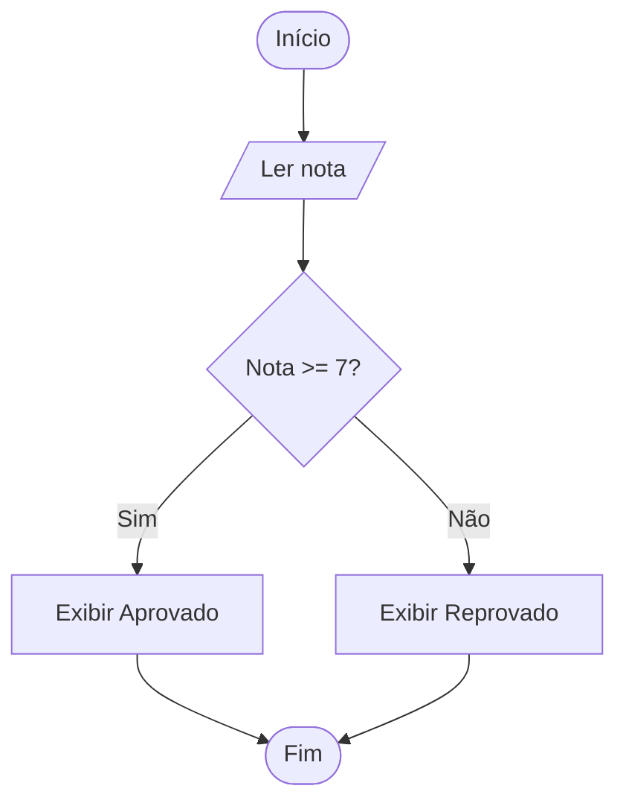

# Módulo 2: Estruturas Condicionais e Desvios Lógicos

Este material serve como guia de consulta e referência para o estudo de estruturas condicionais, focando a lógica de programação e sua implementação em Python. O objetivo principal é desenvolver a capacidade de resolver problemas que exigem a tomada de decisões por parte do computador.

## Princípio Central: A Lógica Antes do Código

A construção de um programa eficiente não começa na escrita das linhas de código, mas na compreensão profunda do problema. Erros de lógica demonstram despreparo na arte de programar e resultam em atrasos significativos.

Para evitar esses erros, siga rigorosamente a sequência:

> **Problema → EPS → Identificar decisões → Algoritmo → Diagrama → Python → Teste**

### A técnica EPS

Antes de qualquer decisão, identifique os componentes básicos do problema:

- **E — Entrada:** Quais dados o programa vai receber (do usuário, de arquivos ou sensores)?
- **P — Processamento:** Que cálculos ou manipulações de dados são necessários?
- **S — Saída:** O que deve ser mostrado na tela ou entregue como resultado final?

Após essa análise, surge a pergunta fundamental: existe uma decisão?

- **Sim:** É necessário utilizar uma estrutura condicional para desviar o fluxo do programa.
- **Não:** O programa segue um fluxo sequencial simples.

## 1. O Conceito de Decisão em Algoritmos

Um algoritmo é um conjunto de regras formais, ordenadas e finitas para resolver um problema. No fluxo sequencial, as instruções são executadas uma após a outra, sem desvios. No entanto, a maioria dos problemas reais envolve condições.

### Fluxo sequencial vs. fluxo com decisão

- **Fluxo sequencial:** Como uma receita de cozinha em que todos os passos são obrigatórios.
- **Fluxo com decisão:** Um desvio no percurso. Dependendo de uma condição ser verdadeira ou falsa, o computador seguirá caminhos diferentes.

### Operadores relacionais

As decisões são baseadas em comparações. Os operadores relacionais permitem comparar valores:

| Operador | Significado | Exemplo |
| --- | --- | --- |
| `==` | Igual a | `x == 5` |
| `!=` | Diferente de | `x != 0` |
| `>` | Maior que | `nota > 7` |
| `<` | Menor que | `idade < 18` |
| `>=` | Maior ou igual a | `salario >= 1200` |
| `<=` | Menor ou igual a | `temperatura <= 36.5` |

> **Nota importante:** Nunca confunda `=` com `==`.
>
> - `=` é atribuição: guarda um valor em uma variável.
> - `==` é comparação: verifica se dois valores são iguais.

### Valores booleanos

O resultado de qualquer comparação é sempre um valor booleano:

- `True` (verdadeiro)
- `False` (falso)

## 2. Operadores Lógicos: Condições Compostas

Por vezes, uma decisão depende de mais de uma comparação. Para isso, utilizam-se os operadores lógicos:

1. **`and` (E):** A condição só é verdadeira se ambos os lados forem verdadeiros.
2. **`or` (OU):** A condição é verdadeira se pelo menos um dos lados for verdadeiro.
3. **`not` (NÃO):** Inverte o valor lógico: o que é `True` passa a `False` e vice-versa.

## 3. Estruturas Condicionais em Python

### A estrutura `if` (se)

Utilizada quando queremos que algo aconteça apenas se a condição for verdadeira. Se for falsa, o programa ignora o bloco e segue em frente.

### A estrutura `if/else` (se / caso contrário)

Utilizada quando existem dois caminhos exclusivos. Se a condição for verdadeira, o programa executa o bloco `if`; se for falsa, executa obrigatoriamente o bloco `else`.

### A estrutura `if/elif/else` (se / senão se / caso contrário)

Utilizada para múltiplas opções mutuamente exclusivas. O `elif` permite testar uma nova condição caso a anterior tenha sido falsa.

### Indentação: a regra de ouro do Python

Em Python, o que define se um código pertence ou não a uma decisão é o espaçamento (indentação). Todos os comandos dentro de um `if`, `else` ou `elif` devem estar alinhados à direita com um recuo, geralmente de quatro espaços.

## 4. Exemplo Completo Guiado: Aprovação Escolar

**Problema:** Receber a nota de um aluno e informar se ele foi aprovado ou reprovado. O critério de aprovação é nota igual ou superior a 7.

### 4.1 Análise EPS

- **Entrada:** Nota do aluno (número).
- **Processamento:** Verificar se a nota é maior ou igual a 7.
- **Saída:** Mensagem "Aprovado" ou "Reprovado".

### 4.2 Identificação da decisão

- **Existe decisão?** Sim.
- **Linguagem natural:** "Se a nota for maior ou igual a 7, o aluno está aprovado. Caso contrário, está reprovado."

### 4.3 Algoritmo

1. Ler a nota.
2. Se `nota >= 7`:
   - Exibir "Aprovado".
3. Senão:
   - Exibir "Reprovado".

### 4.4 Diagrama de blocos



### 4.5 Implementação em Python

```python
# Entrada de dados (conversão para float para aceitar decimais)
nota = float(input("Digite a nota do aluno: "))

# Estrutura de decisão
if nota >= 7:
    print("Aprovado")
else:
    print("Reprovado")
```

### 4.6 Explicação e teste

- **Teste 1 (valor 8.5):** A condição `8.5 >= 7` é `True`. O programa entra no bloco `if` e imprime "Aprovado".
- **Teste 2 (valor 5.0):** A condição `5.0 >= 7` é `False`. O programa ignora o `if`, segue para o `else` e imprime "Reprovado".

## 5. Exemplos Progressivos de Aplicação

### 5.1 Verificar se um número é positivo

```python
num = int(input("Número: "))

if num > 0:
    print("O número é positivo.")
```

### 5.2 Verificar se uma pessoa pode votar

```python
idade = int(input("Idade: "))

if idade >= 18:
    print("Pode votar.")
else:
    print("Ainda não pode votar.")
```

### 5.3 Identificar o maior entre dois números

```python
a = int(input("Primeiro número: "))
b = int(input("Segundo número: "))

if a > b:
    print("O maior é", a)
else:
    print("O maior é", b)
```

### 5.4 Classificar temperatura (`if/elif/else`)

```python
temp = float(input("Temperatura atual: "))

if temp < 15:
    print("Frio")
elif temp <= 25:
    print("Agradável")
else:
    print("Quente")
```

### 5.5 Múltiplas condições (`and/or`)

**Problema:** Verificar se um candidato pode entrar em uma diversão. A altura mínima é 1,50 m e a idade mínima é 12 anos.

```python
altura = float(input("Altura: "))
idade = int(input("Idade: "))

if altura >= 1.50 and idade >= 12:
    print("Acesso permitido.")
else:
    print("Acesso negado.")
```

## 6. Erros Comuns de Iniciantes

| Erro | Exemplo incorreto | Como corrigir |
| --- | --- | --- |
| Usar `=` para comparar | `if x = 10:` | Use `if x == 10:`. |
| Esquecer os dois pontos | `if x > 5` | Use `if x > 5:`. |
| Errar a indentação | `if x > 0:` sem recuo em `print(x)` | O `print` deve estar recuado. |
| Confundir `and` com `or` | Usar `and` quando apenas uma condição basta. | Releia a lógica do problema. |
| Criar condições desnecessárias | `if x > 0:` e depois `if x <= 0:` | Use `else` para o segundo caso. |
| Escrever código diretamente | Tentar programar sem entender o EPS. | Pare e desenhe o algoritmo primeiro. |

## 7. Exercícios de Aplicação

Aplique a sequência: **EPS → Decisão → Algoritmo → Diagrama → Python → Teste**.

### 7.1 Básicos

1. **Par ou ímpar:** Receba um número inteiro e diga se ele é par ou ímpar. Dica: use o operador resto `num % 2 == 0`.
2. **Desconto:** Se o valor de uma compra for superior a 100 €, aplique um desconto de 10%. Caso contrário, não há desconto. Mostre o valor final.

### 7.2 Intermediários

1. **Maior de três:** Receba três números e mostre qual é o maior deles.
2. **Triângulos:** Receba três lados e verifique se eles podem formar um triângulo. Cada lado deve ser menor que a soma dos outros dois.

### 7.3 Desafio

1. **Calculadora simples:** Receba dois números e um símbolo de operação (`+`, `-`, `*`, `/`). Utilize `if/elif/else` para realizar o cálculo correspondente e mostrar o resultado. Verifique também se há tentativa de divisão por zero.

### Perguntas-guia para os exercícios

- Qual é a entrada?
- Qual é o processamento?
- Existe decisão? Qual é a condição lógica?
- Quais são os caminhos possíveis (sim/não)?

## 8. Folha de Ataque ao Problema (Checklist)

Utilize este guia para resolver qualquer questão de programação:

- [ ] **E — Entrada:** O que vou receber?
- [ ] **P — Processamento:** O que preciso calcular ou fazer?
- [ ] **S — Saída:** O que preciso mostrar?
- [ ] Existe decisão? [ ] Sim / [ ] Não
- [ ] Qual é a condição? Ex.: `idade >= 18`
- [ ] Estrutura necessária: [ ] `if` [ ] `if/else` [ ] `if/elif/else`
- [ ] **Algoritmo:** Escrevi os passos em português?
- [ ] **Diagrama:** Fiz o desenho do fluxo com o losango de decisão?
- [ ] **Python:** Passei para código respeitando a indentação e os `:`?
- [ ] **Teste:** Testei valores que entram no `if` e valores que entram no `else`?

## Nota Final

Estruturas de repetição (`for` e `while`) serão abordadas no Módulo 3. Por agora, concentre-se em dominar o fluxo de decisão.
