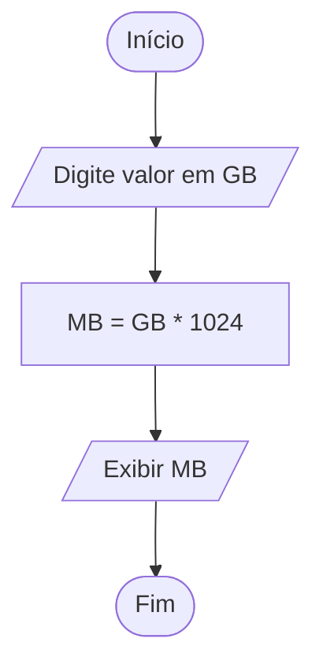
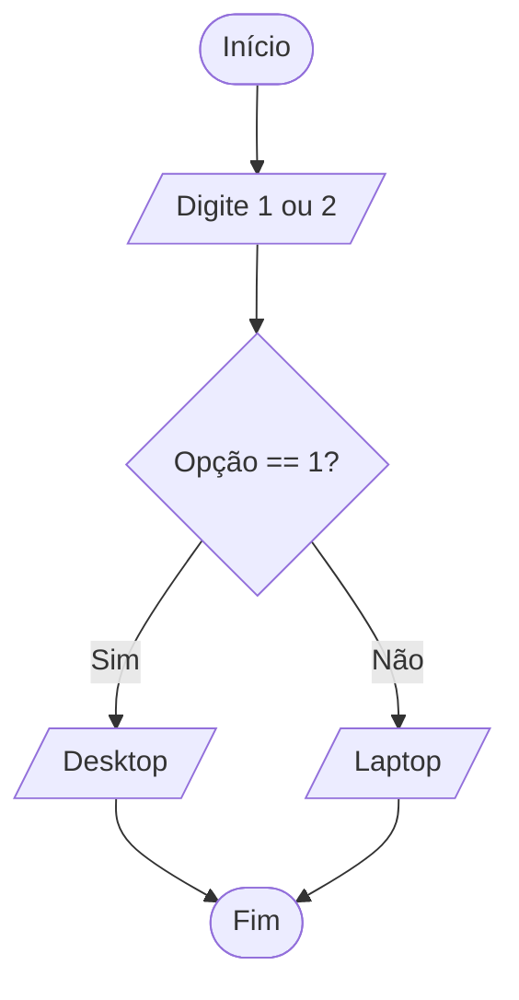
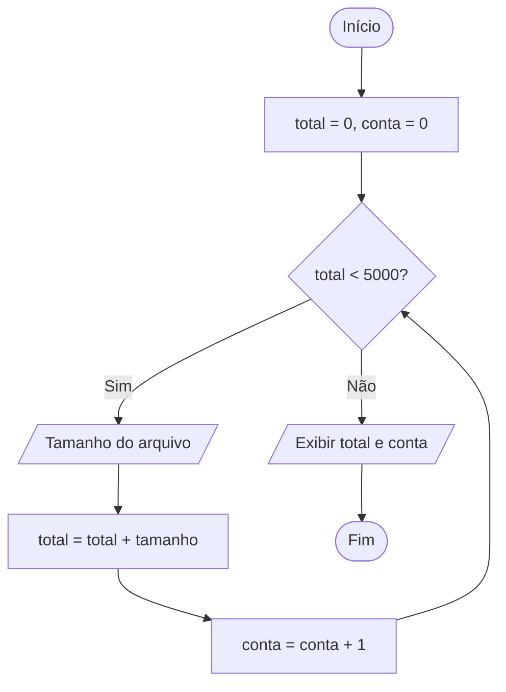

# Lista de Exercícios: Introdução à Programação

Esta lista foi elaborada com base nos princípios de lógica de desenvolvimento, organização de computadores e estruturas algorítmicas presentes nos materiais de estudo. O foco é o desenvolvimento do raciocínio lógico utilizando a linguagem Python.

## Exercícios

### Exercícios fáceis

#### Exercício 1 — Conversor de Unidades de Memória

**Nível:** Fácil

**Problema:** Um programador iniciante precisa calcular quantos Megabytes (MB) existem em uma determinada quantidade de Gigabytes (GB) para dimensionar o uso da memória RAM em um algoritmo. Considere que 1 GB equivale a 1.024 MB.

**O que o programa deve fazer:** Receber um valor em GB e exibir o valor correspondente em MB.

**Perguntas de planejamento:**

1. Qual é a entrada?
2. Qual é o processamento?
3. Qual é a saída?
4. Existe alguma decisão?
5. Existe repetição?
6. Qual estrutura deve ser utilizada?
7. É necessário um contador ou acumulador?

**Tarefa:** Desenvolva o diagrama de blocos e o código em Python.

**Dicas:**

- **Dica 1:** Qual é a operação matemática que transforma uma unidade maior em uma menor quando você sabe o fator de conversão?
- **Dica 2:** Multiplique o valor de entrada pelo fator `1.024`.
- **Dica 3:** Utilize `input()` para a entrada e `print()` para a saída.

#### Exercício 2 — Verificador de Hardware

**Nível:** Fácil

**Problema:** No mercado computacional, os microcomputadores são divididos em categorias como desktops e portáteis (laptops). Crie um programa que ajude a classificar um equipamento.

**O que o programa deve fazer:** O usuário deve digitar `1` para Desktop e `2` para Laptop. O programa deve exibir "Equipamento de mesa" ou "Equipamento portátil" conforme a escolha.

**Perguntas de planejamento:**

1. Qual é a entrada?
2. Qual é o processamento?
3. Qual é a saída?
4. Existe alguma decisão?
5. Existe repetição?

**Tarefa:** Desenvolva o diagrama de blocos e o código em Python.

**Dicas:**

- **Dica 1:** O programa precisa escolher entre dois caminhos baseados em um valor?
- **Dica 2:** Compare a entrada com os valores `1` ou `2`.
- **Dica 3:** Use a estrutura `if/else`.

### Exercícios médios

#### Exercício 3 — Classificação Profissional

**Nível:** Médio

**Problema:** De acordo com o material, a experiência de um programador define seu nível: Trainee (1–3 anos), Júnior (4–6 anos), Pleno (7–9 anos) e Sênior (10 anos ou mais).

**O que o programa deve fazer:** Receber o tempo de experiência, em anos, de um programador e exibir sua classificação profissional.

**Perguntas de planejamento:**

1. Qual é a entrada?
2. Qual é o processamento?
3. Qual é a saída?
4. Existe alguma decisão?
5. Qual estrutura deve ser utilizada?

**Tarefa:** Desenvolva o diagrama de blocos e o código em Python.

**Dicas:**

- **Dica 1:** Quando temos múltiplas faixas de valores, qual estrutura condicional é mais eficiente?
- **Dica 2:** Verifique os limites de cada categoria. Ex.: se `experiência >= 10`, é Sênior.
- **Dica 3:** Utilize `if`, `elif` e `else`.

#### Exercício 4 — Somatório de Bytes

**Nível:** Médio

**Problema:** Um processador de 8 bits processa um byte por vez. Para simular o processamento de um pequeno arquivo, precisamos somar o tamanho de vários pacotes de dados.

**O que o programa deve fazer:** Perguntar quantos pacotes de dados serão processados. Em seguida, pedir o tamanho de cada pacote, em bytes, e mostrar o total acumulado.

**Perguntas de planejamento:**

1. Qual é a entrada?
2. Qual é o processamento?
3. Qual é a saída?
4. Existe repetição?
5. É necessário um contador ou acumulador?

**Tarefa:** Desenvolva o diagrama de blocos e o código em Python.

**Dicas:**

- **Dica 1:** Você sabe de antemão quantas vezes o processo vai se repetir?
- **Dica 2:** Crie uma variável para guardar a soma e atualize-a a cada volta do laço.
- **Dica 3:** Utilize a estrutura `for` e uma variável acumuladora.

#### Exercício 5 — Validação de Entrada de Dados

**Nível:** Médio

**Problema:** Na tabela ASCII padrão, os códigos válidos vão de 0 a 127. Um programa de comunicação precisa garantir que o usuário digite apenas códigos dentro dessa faixa.

**O que o programa deve fazer:** Solicitar um código ASCII. Se o valor for inválido, menor que 0 ou maior que 127, informar o erro e pedir o dado novamente até que um valor válido seja inserido.

**Perguntas de planejamento:**

1. Qual é a entrada?
2. Qual é o processamento?
3. Existe repetição?
4. Quando a repetição termina?
5. Qual estrutura deve ser utilizada?

**Tarefa:** Desenvolva o diagrama de blocos e o código em Python.

**Dicas:**

- **Dica 1:** Qual estrutura de repetição é usada quando não sabemos quantas vezes o usuário vai errar?
- **Dica 2:** A condição de repetição deve ser "enquanto o valor for inválido".
- **Dica 3:** Utilize a estrutura `while`.

#### Exercício 6 — Divisibilidade Computacional

**Nível:** Médio

**Problema:** O material aborda a divisibilidade (múltiplos e divisores). Em sistemas binários, saber se um número é par, divisível por 2, é fundamental.

**O que o programa deve fazer:** Receber um número inteiro e informar se ele é par ou ímpar, utilizando o operador de resto da divisão.

**Perguntas de planejamento:**

1. Qual é a entrada?
2. Qual é o processamento?
3. Qual é a saída?
4. Qual operador matemático indica se um número é divisível por outro?

**Tarefa:** Desenvolva o diagrama de blocos e o código em Python.

**Dicas:**

- **Dica 1:** Se o resto da divisão de um número por 2 for zero, o que isso significa?
- **Dica 2:** Utilize o operador `%` (módulo).
- **Dica 3:** Aplique `if` para verificar se `numero % 2 == 0`.

### Exercícios difíceis

#### Exercício 7 — Monitoramento de Memória Secundária

**Nível:** Difícil

**Problema:** Um servidor de grande porte (Mainframe) armazena dados em dispositivos de massa. O sistema precisa monitorar o preenchimento de um disco de 5.000 MB.

**O que o programa deve fazer:** Começar com 0 MB ocupados. O usuário deve inserir o tamanho dos arquivos que estão sendo gravados, um por um. O programa deve parar de aceitar arquivos quando o total atingir ou ultrapassar 5.000 MB. Ao final, deve mostrar o total ocupado e quantos arquivos foram gravados.

**Perguntas de planejamento:**

1. Qual é a entrada?
2. Qual é o processamento?
3. Qual é a saída?
4. Existe repetição? Qual é o critério de parada?
5. É necessário um contador e um acumulador?

**Tarefa:** Desenvolva o diagrama de blocos e o código em Python.

**Dicas:**

- **Dica 1:** Como controlar o limite de 5.000 e, ao mesmo tempo, contar quantos arquivos entraram?
- **Dica 2:** Use um acumulador para o tamanho e um contador para a quantidade de arquivos.
- **Dica 3:** Use `while acumulador < 5000:`.

#### Exercício 8 — Simulador de Misto Quente (Algoritmo Culinário)

**Nível:** Difícil

**Problema:** Com base na analogia entre algoritmos e receitas, vamos automatizar a produção de "mistos quentes" em uma lanchonete. Cada sanduíche consome 2 fatias de pão, 1 de presunto e 1 de queijo.

**O que o programa deve fazer:** Informar a quantidade total de fatias de pão, presunto e queijo disponíveis no estoque. O programa deve calcular e exibir quantos sanduíches completos podem ser feitos e quanto sobrou de cada ingrediente.

**Perguntas de planejamento:**

1. Quais são as entradas?
2. Qual é o processamento? Como determinar o limitador da produção?
3. Existe decisão composta?
4. Como calcular as sobras?

**Tarefa:** Desenvolva o diagrama de blocos e o código em Python.

**Dicas:**

- **Dica 1:** O número de sanduíches é limitado pelo ingrediente que acabar primeiro.
- **Dica 2:** Calcule o potencial de cada ingrediente, como `pão // 2`, e descubra o menor valor.
- **Dica 3:** Utilize `min()` ou estruturas `if/elif` para encontrar o limitante.

#### Exercício 9 — Análise de Salários no Mercado

**Nível:** Difícil

**Problema:** Uma empresa de consultoria quer analisar o perfil salarial do mercado. Ela precisa coletar dados de vários profissionais até que o usuário decida parar.

**O que o programa deve fazer:** Ler o salário de vários programadores. Para cada salário, perguntar se o usuário deseja continuar (`S/N`). Ao final, exibir:

1. A média salarial do grupo.
2. O maior salário informado.
3. O menor salário informado.

**Perguntas de planejamento:**

1. Quais estruturas de repetição e decisão serão combinadas?
2. Como inicializar as variáveis de maior e menor valor?
3. Como calcular a média sem saber o número total de entradas de antemão?

**Tarefa:** Desenvolva o diagrama de blocos e o código em Python.

**Dicas:**

- **Dica 1:** A cada nova entrada, compare o salário atual com o maior e o menor armazenados anteriormente.
- **Dica 2:** Use um contador para saber por quanto dividir o total acumulado na hora da média.
- **Dica 3:** Utilize um laço `while` com uma flag de saída, como `continuar == 'S'`.

#### Exercício 10 — Sistema de Login Binário

**Nível:** Difícil

**Problema:** Sistemas operacionais de baixo nível utilizam estados binários (0 e 1) para permissões. Crie um sistema que valide o acesso a uma área restrita do Mainframe.

**O que o programa deve fazer:** O usuário tem 3 tentativas para digitar a senha numérica correta, por exemplo, `1010`. Se acertar, exibir "Acesso Concedido" e parar o programa. Se errar as 3 vezes, exibir "Sistema Bloqueado".

**Perguntas de planejamento:**

1. Existe repetição? Qual é o limite de tentativas?
2. Existe decisão dentro da repetição?
3. Como interromper o laço antes das 3 tentativas se o usuário acertar a senha?
4. Como distinguir, ao final do laço, se ele saiu por acerto ou por excesso de tentativas?

**Tarefa:** Desenvolva o diagrama de blocos e o código em Python.

**Dicas:**

- **Dica 1:** Use um contador de tentativas começando em 1.
- **Dica 2:** Dentro do laço, use `if` para verificar a senha e `break` se ela estiver correta.
- **Dica 3:** Use uma variável booleana (flag) para saber se o acesso foi liberado.

## Gabarito

### Solução — Exercício 1: Conversor de Unidades

#### EPS — Exercício 1

- **E:** Valor em GB.
- **P:** `GB * 1024`.
- **S:** Valor em MB.

#### Estratégia — Exercício 1

Operação aritmética simples.

#### Algoritmo — Exercício 1

Ler GB; calcular `MB = GB * 1024`; escrever MB.

#### Diagrama — Exercício 1



#### Código Python — Exercício 1

```python
gb = float(input("Digite a quantidade de GB: "))
mb = gb * 1024
print(f"O valor em MB é: {mb}")
```

#### Teste — Exercício 1

**Entrada:** 2 GB. **Saída:** 2048 MB.

### Solução — Exercício 2: Verificador de Hardware

#### EPS — Exercício 2

- **E:** Opção (`1` ou `2`).
- **P:** Comparação.
- **S:** Tipo de equipamento.

#### Estratégia — Exercício 2

Decisão simples.

#### Diagrama — Exercício 2



#### Código Python — Exercício 2

```python
opcao = input("1 - Desktop / 2 - Laptop: ")

if opcao == "1":
    print("Equipamento de mesa")
else:
    print("Equipamento portátil")
```

### Solução — Exercício 3: Classificação Profissional

#### EPS — Exercício 3

- **E:** Anos de experiência.
- **P:** Faixas de decisão.
- **S:** Categoria profissional.

#### Algoritmo — Exercício 3

Se `anos >= 10`: Sênior; senão, se `anos >= 7`: Pleno; senão, se `anos >= 4`: Júnior; caso contrário: Trainee.

#### Código Python — Exercício 3

```python
exp = int(input("Anos de experiência: "))

if exp >= 10:
    print("Sênior")
elif exp >= 7:
    print("Pleno")
elif exp >= 4:
    print("Júnior")
else:
    print("Trainee")
```

### Solução — Exercício 4: Somatório de Bytes

#### EPS — Exercício 4

- **E:** Quantidade de pacotes e tamanho de cada pacote.
- **P:** `soma = soma + atual`.
- **S:** Total acumulado.

#### Código Python — Exercício 4

```python
qtd = int(input("Quantos pacotes? "))
total = 0

for i in range(qtd):
    tamanho = int(input(f"Tamanho do pacote {i + 1}: "))
    total += tamanho

print(f"Total acumulado: {total} bytes")
```

### Solução — Exercício 5: Validação ASCII

#### EPS — Exercício 5

- **E:** Código.
- **P:** Verificar se `código < 0` ou `código > 127`.
- **S:** Mensagem de erro ou sucesso.

#### Código Python — Exercício 5

```python
codigo = -1

while codigo < 0 or codigo > 127:
    codigo = int(input("Digite o código ASCII (0-127): "))
    if codigo < 0 or codigo > 127:
        print("Código inválido!")

print(f"Código {codigo} aceito.")
```

### Solução — Exercício 6: Divisibilidade

#### EPS — Exercício 6

- **E:** Número.
- **P:** `numero % 2`.
- **S:** Par ou ímpar.

#### Código Python — Exercício 6

```python
num = int(input("Digite um número: "))

if num % 2 == 0:
    print("O número é par")
else:
    print("O número é ímpar")
```

### Solução — Exercício 7: Monitoramento de Disco

#### EPS — Exercício 7

- **E:** Tamanho do arquivo.
- **P:** Acumular e contar.
- **S:** Total e quantidade de arquivos.

#### Diagrama — Exercício 7



#### Código Python — Exercício 7

```python
total = 0
conta = 0

while total < 5000:
    arq = float(input("Tamanho do arquivo (MB): "))
    total += arq
    conta += 1

print(f"Disco cheio com {total} MB. Total de {conta} arquivos.")
```

### Solução — Exercício 8: Simulador de Misto Quente

#### EPS — Exercício 8

- **E:** Pão, presunto e queijo.
- **P:** Divisão inteira e identificação do menor potencial.
- **S:** Quantidade de sanduíches e sobras.

#### Código Python — Exercício 8

```python
pao = int(input("Quantidade de fatias de pão: "))
pre = int(input("Quantidade de fatias de presunto: "))
que = int(input("Quantidade de fatias de queijo: "))

# Cada sanduíche precisa de 2 fatias de pão, 1 de presunto e 1 de queijo.
possivel_pao = pao // 2
possivel_pre = pre // 1
possivel_que = que // 1

qtd_final = min(possivel_pao, possivel_pre, possivel_que)

print(f"Podem ser feitos {qtd_final} sanduíches.")
print(f"Sobras: pão: {pao - qtd_final * 2}, presunto: {pre - qtd_final}, queijo: {que - qtd_final}")
```

### Solução — Exercício 9: Análise Salarial

#### Estratégia — Exercício 9

Usar `while True` com `break` e os comparadores `max()` e `min()`.

#### Código Python — Exercício 9

```python
salarios = []

while True:
    salario = float(input("Salário: "))
    salarios.append(salario)
    resposta = input("Continuar? (S/N): ").upper()
    if resposta == "N":
        break

media = sum(salarios) / len(salarios)
print(f"Média: {media:.2f}")
print(f"Maior: {max(salarios)} | Menor: {min(salarios)}")
```

### Solução — Exercício 10: Login Binário

#### EPS — Exercício 10

- **E:** Senha.
- **P:** Loop com limite de 3 tentativas e verificação.
- **S:** Status do acesso.

#### Código Python — Exercício 10

```python
senha_correta = "1010"
tentativas = 0
acesso = False

while tentativas < 3:
    senha = input("Senha: ")
    if senha == senha_correta:
        acesso = True
        break
    else:
        tentativas += 1
        print(f"Incorreto! Tentativas restantes: {3 - tentativas}")

if acesso:
    print("Acesso concedido")
else:
    print("Sistema bloqueado")
```
