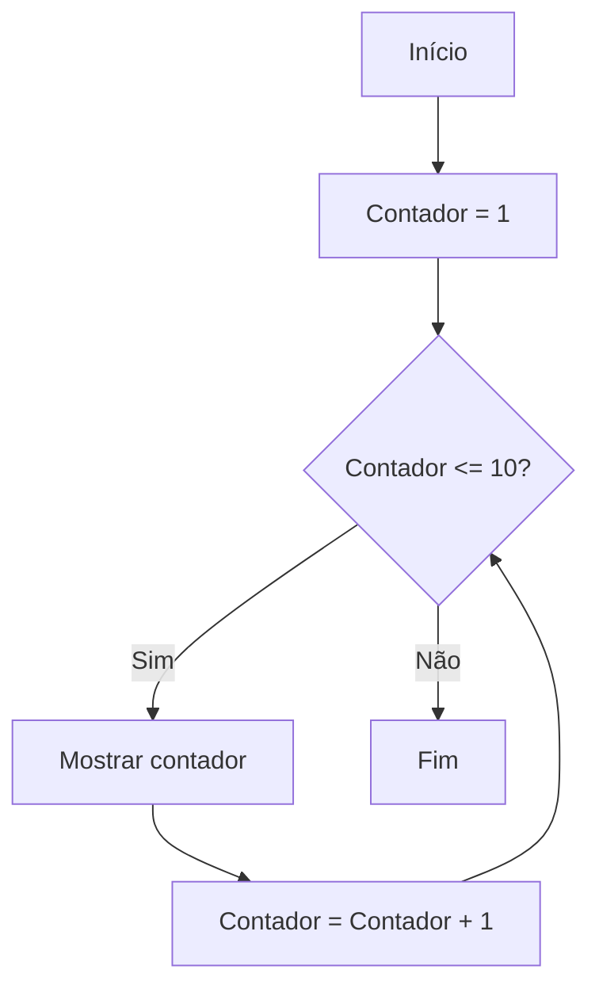

# Módulo 3: Estruturas de Repetição

## `for` e `while`

Este documento serve como guia de consulta e referência para alunos de Introdução à Programação. O objetivo central é capacitar o aluno a identificar a necessidade de repetição, planejar a lógica de solução e implementar o código correto em Python, integrando conceitos de entrada, processamento e saída.

## 1. O Princípio Central: Entender Antes de Codificar

A programação não é apenas escrever código; é resolver problemas. Para resolver qualquer questão computacional, siga rigorosamente esta sequência:

> **Não comece pelo código. Primeiro entenda o problema.**
>
> Problema → EPS → Identificar decisões → Algoritmo → Diagrama → Python → Teste

### A metodologia de trabalho (EPS)

Antes de abrir o editor de Python, aplique a estrutura EPS:

- **E — Entrada:** Quais são os dados necessários? (Ingredientes.)
- **P — Processamento:** Que cálculos ou ações devem ser realizados? (Modo de preparo.)
- **S — Saída:** O que deve ser exibido ao usuário final? (Prato pronto.)

Após definir o EPS, faça duas perguntas cruciais:

1. Existe decisão? Se sim, utilize `if`, `elif` ou `else`.
2. Existe repetição? Se sim, utilize `for` ou `while`.

## 2. Conceitos de Repetição (Loops)

Uma estrutura de repetição, também chamada de laço ou loop, permite que um conjunto de instruções seja executado várias vezes até que uma condição seja satisfeita. Todo loop deve ter, obrigatoriamente, um fim.

### 2.1 Estrutura `while` (laço condicional)

O `while` (enquanto) é utilizado quando a repetição depende de uma condição lógica. É ideal quando não sabemos previamente quantas vezes o código será repetido.

#### Elementos fundamentais

- **Condição de repetição:** Uma expressão que, enquanto for verdadeira, mantém o loop ativo.
- **Condição de parada:** O momento em que a expressão se torna falsa.
- **Atualização da variável de controle:** É obrigatório alterar o valor da variável dentro do loop para evitar o loop infinito.

### 2.2 Estrutura `for` (laço por contagem)

O `for` (para) é utilizado quando sabemos ou conseguimos determinar a quantidade de repetições antes do laço começar. Ele utiliza a função `range()` para controlar o fluxo.

#### A função `range()`

| Comando | Descrição | Exemplo |
| --- | --- | --- |
| `range(fim)` | Começa em 0 e vai até `fim - 1`. | `range(5)` → `0, 1, 2, 3, 4` |
| `range(início, fim)` | Começa em `início` e vai até `fim - 1`. | `range(1, 6)` → `1, 2, 3, 4, 5` |
| `range(início, fim, passo)` | Começa em `início` e avança de acordo com `passo`. | `range(1, 10, 2)` → `1, 3, 5, 7, 9` |

## 3. Como Escolher entre `for` e `while`

Embora ambos possam resolver muitos problemas, existe uma regra prática para a tomada de decisão:

- **`for`:** A quantidade de repetições é conhecida. Ex.: ler 10 notas ou mostrar números de 1 a 100.
- **`while`:** A quantidade de repetições é desconhecida ou depende de um evento externo. Ex.: ler números até que o usuário digite zero.

## 4. Exemplo Completo: Mostrar Números de 1 a 10

### Análise EPS do exercício

- **Entrada:** Nenhuma (os valores são fixos).
- **Processamento:** Incrementar um valor de 1 em 1 até chegar a 10.
- **Saída:** Mostrar cada número na tela.

### Fluxo de repetição



### Implementação em Python

#### Com `for` (mais adequado para este caso)

```python
for i in range(1, 11):
    print(i)
```

#### Com `while`

```python
contador = 1

while contador <= 10:
    print(contador)
    contador = contador + 1  # Atualização da variável
```

### Teste de mesa (trace table)

O teste de mesa ajuda a verificar a lógica antes e depois da codificação.

| Iteração | Variável `contador` | Condição (`<= 10`) | Saída |
| :---: | ---: | :---: | ---: |
| 1ª | 1 | Verdadeiro | 1 |
| 2ª | 2 | Verdadeiro | 2 |
| ... | ... | ... | ... |
| 10ª | 10 | Verdadeiro | 10 |
| 11ª | 11 | Falso | Sai do loop |

## 5. Exemplo em que o `while` é Superior

**Problema:** Receber números até que o usuário digite `0`. Neste caso, não sabemos se o usuário digitará `0` na primeira vez ou após várias tentativas.

```python
numero = -1  # Inicialização com valor que não encerra o loop

while numero != 0:
    numero = int(input("Digite um número (0 para sair): "))
```

## 6. Contador e Acumulador

Durante as repetições, é comum precisarmos de variáveis para guardar estados:

1. **Contador:** Incrementa um valor fixo, geralmente `+1`. É usado para contar ocorrências. Exemplo: `contador = contador + 1`.
2. **Acumulador:** Soma valores variáveis. É usado para totais e médias. Exemplo: `soma = soma + numero`.
3. **Variável de controle:** Controla se o loop deve continuar ou parar, como `i` no `for` ou `numero` no `while`.

## 7. Integração: Repetição + Decisão

**Problema:** Ler 5 números e informar quantos são positivos.

### Análise EPS

- **E:** 5 números inteiros.
- **P:** Repetir 5 vezes: ler um número, verificar se `numero > 0` e, se sim, incrementar o contador.
- **S:** Total de números positivos.

### Implementação

```python
positivos = 0

for i in range(5):
    num = int(input("Digite um número: "))
    if num > 0:
        positivos = positivos + 1

print("Total de positivos:", positivos)
```

## 8. Erros Comuns e Como Evitá-los

- **Loop infinito no `while`:** Esquecer de atualizar a variável de controle, como esquecer `contador = contador + 1`.
- **Erro de limite no `range()`:** Lembre-se de que `range(1, 10)` termina no 9. Para incluir o 10, use `range(1, 11)`.
- **Inicialização incorreta:** Contadores e acumuladores devem começar em `0` ou `1`, dependendo da lógica, antes de o loop começar.
- **Indentação:** Em Python, o código que será repetido deve estar obrigatoriamente recuado em relação ao comando `for` ou `while`.

## 9. Exercícios de Preparação

Tente resolver os problemas abaixo seguindo a sequência:

> **EPS → Decisão/repetição? → Algoritmo → Python**

1. **Básico `for` 1:** Crie um programa que mostre todos os números pares de 2 até 20.
2. **Básico `for` 2:** Crie um programa que receba um número e mostre a sua tabuada de 1 a 10.
3. **Básico `while` 1:** Peça uma palavra-passe ao usuário e repita a pergunta até que ele acerte o valor `"python123"`.
4. **Básico `while` 2:** Leia números do usuário e some-os. Pare quando a soma total ultrapassar 100.
5. **Repetição + `if`:** Leia 10 números e, ao final, diga quantos são pares e quantos são ímpares.
6. **Desafio do acumulador:** Leia o preço de 5 produtos e calcule o valor total da compra e a média de preço dos produtos.

### Perguntas-guia para cada exercício

- Qual é a entrada, o processamento e a saída?
- A quantidade de repetições é conhecida?
- Preciso de um contador ou de um acumulador?
- Qual é a condição exata para o loop terminar?
